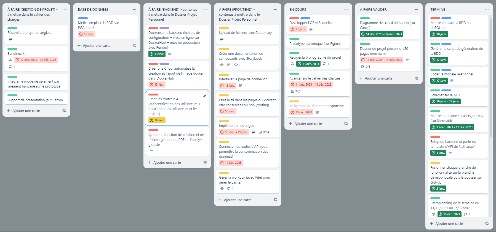
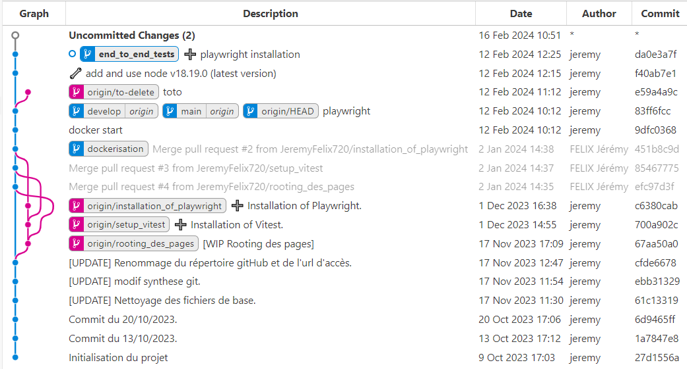
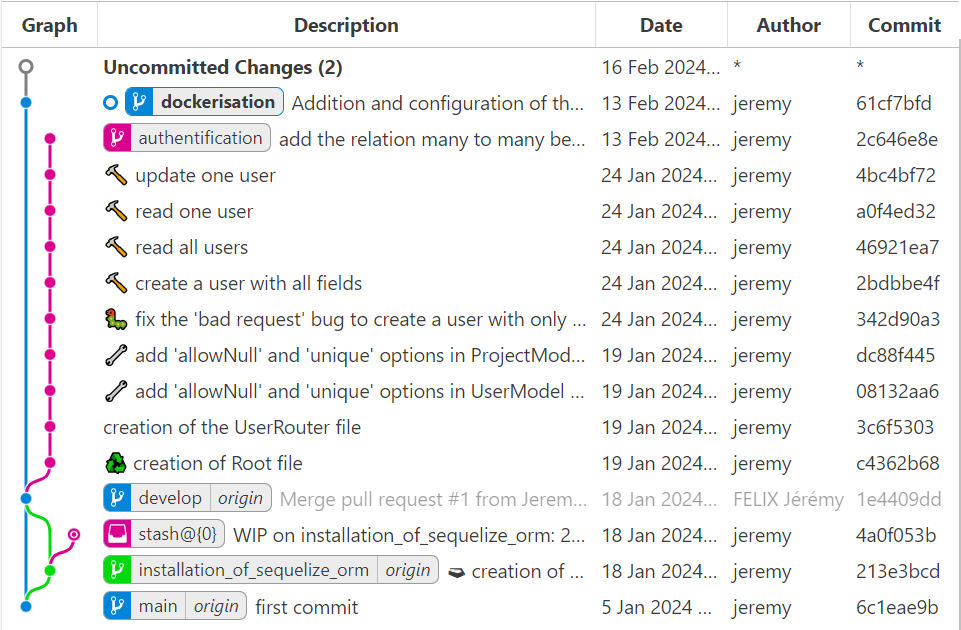
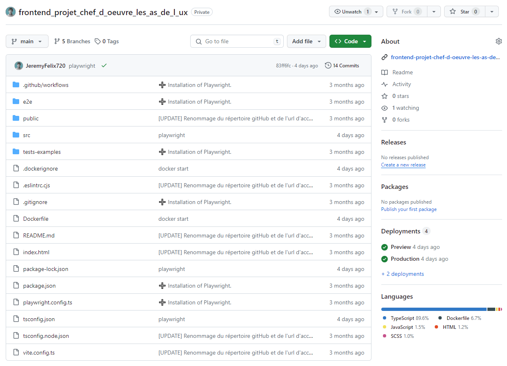
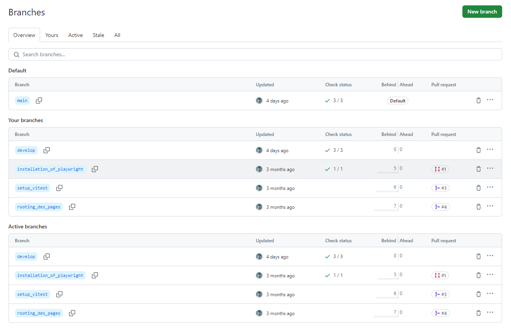
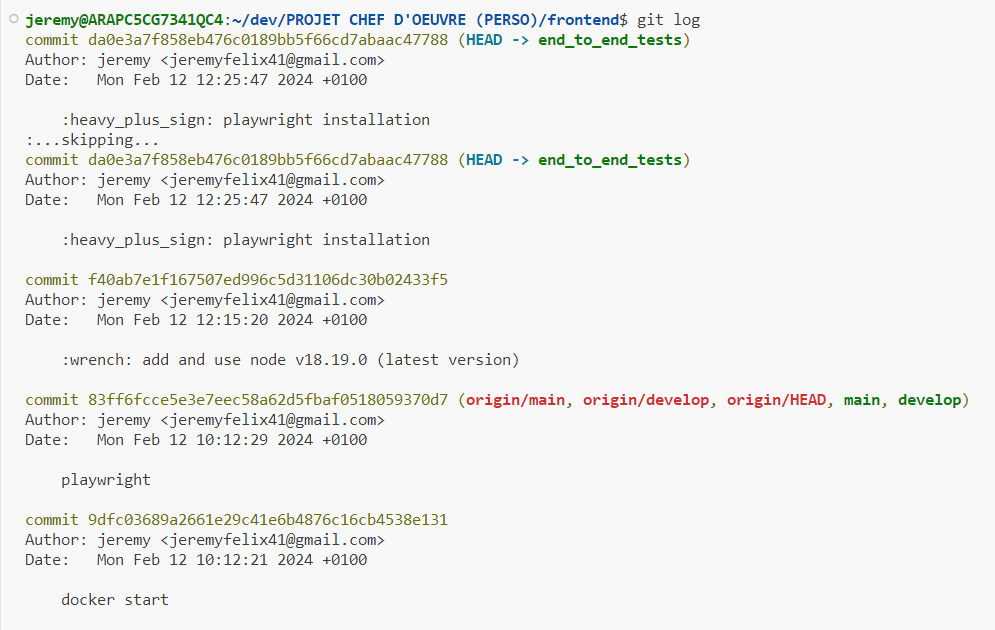

## 2.1 - UTILISATION DE GIT ET GITHUB

### COMPETENCE(S) CONCERNEE(S) DANS LE REFERENTIEL

**C1. Assurer le versionnement d’un code source d’une application organisée en fonctionnalités et lots à l’aide d’un logiciel de contrôle de version de manière à garantir la fiabilité du code source dans un environnement multi-contributeurs**
- Les sources sont versionnées avec Git
- Git en ligne de commande
- Respect d’un gitflow
- Utilisation de Github ou Gitlab par exemple


### OBJECTIF PRINCIPAL DE CETTE PHASE DU PROJET

L'utilisation d'un outil de versionning (tel que git) et d'une plateforme de dépot de code source en ligne (tel que GitHub) permet à chaque développeur de disposer d’une copie complète du projet et de l’historique du projet.

Contrairement aux systèmes de gestion de versions centralisés autrefois populaires, les systèmes VCS distribués n’ont pas besoin d’une connexion constante à un dépôt central (chacun peut travailler un local sur une version à jour du code source collectif).

Git est le système de gestion de versions distribué le plus populaire et il est couramment utilisé pour le développement de logiciels open source et commerciaux, avec des avantages significatifs pour les individus, les équipes et les entreprises.


#### UTILISATION DES BRANCHES

La stratégie de création de branches permet à plusieurs développeurs de travailler sur différentes fonctionnalités et améliorations de la base de code, sans interférer avec le travail des autres développeurs.

Voici les principaux avantages :

- Plusieurs développeurs peuvent travailler sur la même base de code en parallèle, chacun sur leur branche de travail respective, en évitant les conflits et les problèmes de fusion

- Les développeurs peuvent apporter des modifications plus rapidement et plus efficacement sans se soucier d’interrompre le travail des autres développeurs

- Les modifications de la base de code sont correctement testées et vérifiées avant d’être fusionnées dans la branche principale. Cela permet de maintenir la qualité du code et réduit le risque de bugs et d’erreurs

- Possibilité de suivre les différentes versions du code source. Cela permet de dépanner et de revenir aux versions précédentes facilement

- Modifications effectuées sans affecter la base de code principale. Cela réduit considérablement le risque d’introduction de bugs et d’erreurs dans la production

- Expérimentation de nouvelles fonctionnalités et idées sans casser le code source et ne intégration des branches dans la branche principale que si elles fonctionnent parfaitement

- Meilleure communication entre les développeurs pour discuter des modifications plus facilement lors des Code Review (c'est-à-dire, l'examen systématique du code source d'un logiciel par des tiers dont le but est de trouver des bugs ou des vulnérabilités)


### REFLEXION ET APPLICATION D'UNE STRATEGIE DANS MON PROJET


#### GESTION DE PROJET

Pour me permettre de diviser le travail en plusieurs petits bouts de fonctionnalité cohérents, j'ai utilisé l'outil de gestion de projet Trello avec la méthodologie Agile KANBAN en réalisant plusieurs colonnes dans lesquelles j'ai rajouté au fur et à mesure des "tickets" datés comme on peut le voir sur la capture d'écran suivante :



Les branches de fonctionnalité que j'ai créées dans mon code découlent naturellement des tickets référencés sur Trello.


#### ENVIRONNEMENT DE DEVELOPPEMENT

J'ai choisi d'utiliser l'IDE "Visual Studio Code" pour une question de facilité d'utilisation.


#### GITFLOW

Un workflow Git est une recette ou une recommandation expliquant comment utiliser Git pour accomplir une tâche de façon cohérente et productive. Les workflows Git encouragent les développeurs et les équipes DevOps à exploiter Git de façon efficace et cohérente.

Pour m'aider à respecter une méthodologie de gitflow, j'ai installé l'extenssion "Git Graph" sur mon IDE afin de pouvoir visualiser les différentes branches et sous-branches ainsi que les commits qui leur sont associés.

___

Capture d'écran de l'interface de Git Graph du frontend de mon projet :



___

Capture d'écran de l'interface de Git Graph du backend de mon projet :



___

Etant seul dans le cadre de ce projet, j'ai décidé d'autovalider les pull requests sur GitHub mais cela ne m'a pas empeché de travailler de façon structurée (comme si j'étais en groupe) en créant des branches de fonctionnalité sur une branche develop (une sous-branche de main) pour y integrer les évolutions constantes du code source (avec potentielement des erreurs qui viennent s'y greffer) et pas directement dans la branche main qui doit être réservée à la mise en production (avec une version stable de l'application, sans anomalie, avec un ensemble cohérent de fonctionnalités et suffisant pour le déployer en ligne sans mauvaise surprise).

___

Voici la procédure que j’ai appliquée pour envoyer une branche de fonctionnalité sur GitHub afin d’effectuer la validation collective (uniquement lorsqu'une branche de travail est entièrement terminée) :

On peut travailler sur plusieurs branches en parralèle (il faut simplement faire toutes les étapes suivantes quand une des branches est terminée).

Rejoindre la branche "develop" :
```bash
git checkout develop
```

Récupérer les dernieres modifications sur la branche develop depuis la branche develop du dépôt distant :
```bash
git pull origin develop 
```

Rejoindre sa branche de travail :
```bash
git checkout fonctionnality_branch_name
```

Fusionner ma branche de fonctionnalité avec la branche "develop" en local :
```bash
git rebase develop  # contrairement à git merge, git rebase ne supprime pas les commits.
```

Exporter ma branche de fonctionnalité dans le répertoire distant :
```bash
git push --set-upstream origin fonctionnality_branch_name
```

**Faire valider sa Pull Request (sur gitHub) par ses collègues (ou par un formateur)**

Sur GitHub :
- Aller dans "Pull requests" > "New pull request"
- Choisir la branche "develop" à gauche et la branche de fonctionnalité à droite
- Créer la pull request
- Retourner dans "Pull requests" (normalement, cela ouvre la Pull Request automatiquement)
- Vérifier le code au préalable
- Cliquer sur "Merge pull request" puis "Confirm merge"

Si la pull request de ma fonctionnalité a été validée à l'unanimité sur GitHub, mettre à jour la branche develop locale qui a été fusionnée sur GitHub :
```bash
git checkout develop
git pull origin develop
```

Supprimer la branche de fonctionnalité locale :
```bash
git branch -d fonctionnality_branch_name
```

Passer au ticket suivant en recréant une nouvelle branche de fonctionnalité à partir de la branche develop.


#### ORGANISATION DES DOSSIERS

Pour simplifier l'organisation de mon travail, j'ai décomposé mon projet en plusieurs "microservices" (aux contenus cohérents mais plus réduits), c'est-à-dire des répertoires en local (frontend, backend et documentation), qui sont tous reliés à des répertoires distants aux contenus équivalents.

___
Capture d'écran du répertoire pour le frontend hébergé sur gitHub :


___

Capture d'écran des branches sur GitHub de la partie frontend :


___

De plus, j'ai créé un 3ème répertoire sur GitHub pour sauvegarder tous les documents en lien avec la gestion de mon projet chef-d'oeuvre.


#### VERSIONNEMENT DU CODE SOURCE

Pour pouvoir revenir facilement en arrière lorsqu’un bug survient, j'ai pris l'habitude de faire des commits (sauvegarde du code en local) afin de conserver un historique des modifications effectuées dans le code, comme en témoigne la capture d'écran suivante (après avoir tapé la commande ```git log``` dans le terminal) :



___

Pour me rappeler de faire des commits régulièrement (à chaque ajout de code fonctionnel et cohérent), j’ai lancé un timmer en arrière-plan qui émet un « bip » tous les 15 minutes.

Cela m'a également permit de nommer plus efficacement mes commits. A noter que le site gitmoji.dev m’a permit d’illustrer le nommage de mes commit de façon visuelle.


#### COMMANDE GIT QUE J'AI UTILISEES

Voici une liste (non exaustive) des commandes git que j'ai utilisées dans le cadre de mon projet :

Cloner un répertoire :
```bash
git clone https://github.com/nom_depositaire/repository_name my_project_name 
```

Créer une branche de travail sur le dépot local (pour developper une fonctionnalité correspondant à un ticket) :
```bash
git branch fonctionnality_branch_name
```

Créer une branche de travail sur le dépot distant (à partir d'une branche locale existante) :
```bash
git push --set-upstream origin develop
```

Se déplacer sur une branche :
```bash
git checkout fonctionnality_branch_name
```

Créer une branche et se déplacer dessus :
```bash
git checkout -b fonctionnality_branch_name
```

Voir le nom de la branche sur laquelle on se trouve actuellement :
```bash
git branch
```

Renommer une branche :
```bash
git branch -m new_branch_name
```

Voir l'historique des commits de sa branche de travail :
```bash
git log
```

Ajouter tous les fichiers (ou seulement certains) dans la zone d'index pour le prochain commit :
```bash
git add .
```

Faire une sauvegarde local de son code source :
```bash
git commit -m "message de commit"
```

Envoyer le code source depuis le dépot local vers le dépot distant :
```bash
git push
```

Réinitialiser les derniers changements (ne marche pas si on a fait un push avant) :
```bash
git stash
```

Réinitialiser les derniers changements depuis son dernier commit :
```bash
git stash apply
```

Revenir au commit précedent :
```bash
git reset --soft HEAD^
```
ou
```bash
git reset --soft branch_name
```

Etc.