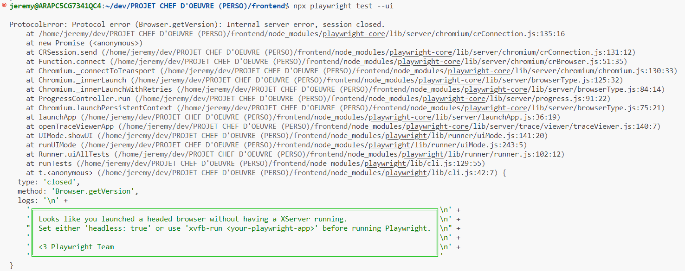
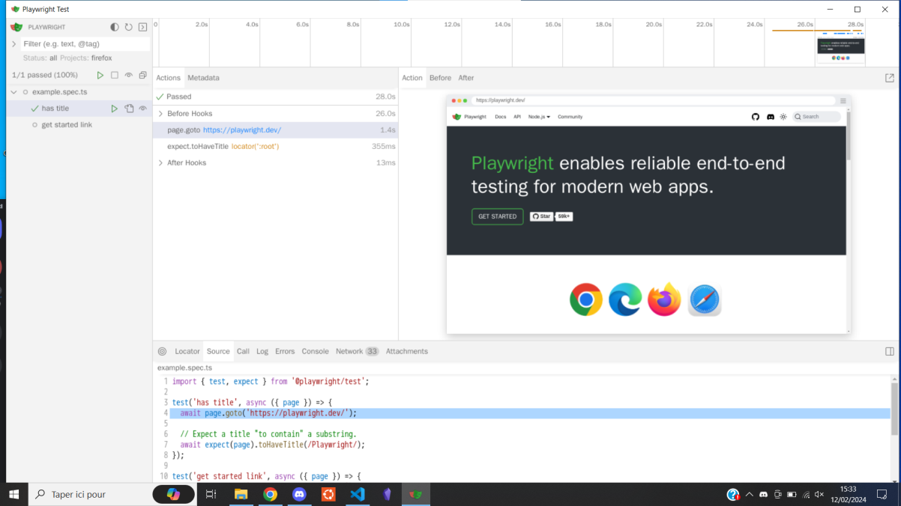
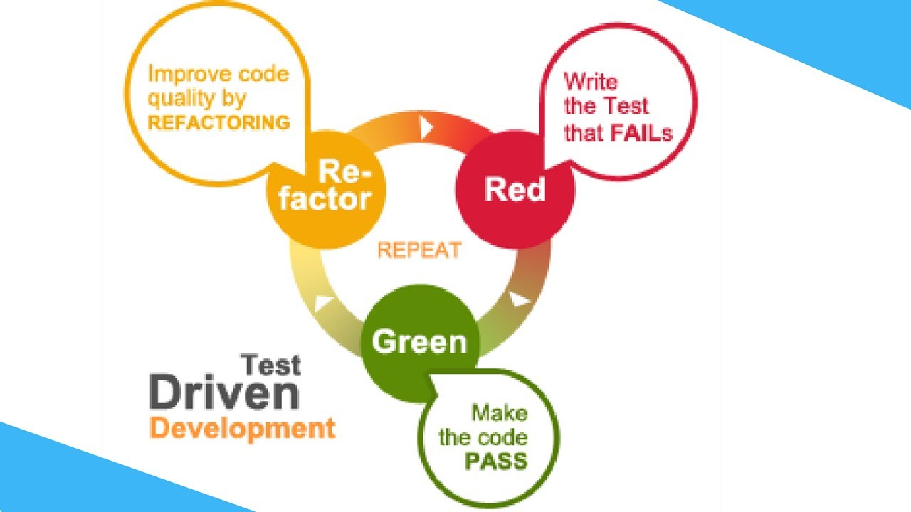

## 2.2 - CONTROLE QUALITE

### COMPETENCE(S) CONCERNEE(S) DANS LE REFERENTIEL

**C2. Contrôler l'exécution du code source à l’aide de tests et d’outils d’analyses statiques du code source afin de minimiser le risque d’erreur dans un contexte de livraison continue**
- Utilisation d’un linter (natif IDE ou externe)
- Environnement de test (virtuel ou conteneurisé par exemple)
- Au moins des tests unitaires d’intégrés (pas de minimum de coverage)
- Au moins des tests fonctionnels d’intégrés (pas de minimum de coverage)
- Savoir récupérer la valeur de la couverture du code par les tests
- Exécuter les tests
- Interpréter les résultats et les erreurs

### OBJECTIF PRINCIPAL DE CETTE PHASE DU PROJET

L'élaboration de tests est essentiel pour s'assurer que le code produit correspond à des exigences de qualités (bonnes pratiques universelles ou définie au sein d'une équipe).

Or, dans le déroulement du projet chef d'oeuvre, je n'avais pas encore réaliser l'implémentation de mon prototype dans le code. Cette partie du dossier traitera donc de tous les tests que je prévois d'effectuer à l'avenir.

### REFLEXION ET APPLICATION D'UNE STRATEGIE DANS MON PROJET

#### CHOIX ET UTILISATION D'UN LINTER

##### UTILITE D'UN LINTER

Un linter permet d'analyse les erreurs statiques (c'est-à-dire, sans exécuter le code). Par exemples, il vérifie statiquement :
- les variables qui n'existent pas
- les variables inutilisées
- les doubles déclarations de variables, de fonctions, etc.
- la mauvaise organisation du code
- le non respect des bonnes pratiques d'écriture de code
- les erreurs de syntaxe

Une fois analysé par le linter et corrigé (automatiquement ou manuellement), le code résultant est plus lisible et plus cohérent, ce qui le rend plus facile à maintenir et à déboguer.

##### VEILLE TECHNOLOGIQUE SUR LES LINTERS

Dans le cadre de mon projet, j'ai comparé les linters suivants :
1. ESLint
2. JSLint

1. Voici les avantages de ESLint :
- c'est le linter JavaScript le plus répandu
- il est compatible avec la majorité des éditeurs de textes
- l'affichage des erreurs et les warnings se font directement dans le code
- il est très simple à installer
- il est entièrement personnalisable
- il peut corriger automatiquement les erreurs

2. Voici les avantages de JSLint :
- c'est un outil Open Source
- il est strict et applique un ensemble spécifique de règles pour l’écriture de code JavaScript (il exige par exemples l'utilisation des points-virgules, des accolades autour des déclarations conditionnelles et des boucles, etc.)
- il est compatible avec plusieurs éditeurs de textes

Pour l'analyse statique de mon code, j'ai opté pour le linter ESLint pour sa simplicité d'utilisation et sa compatibilité avec JavaScript et avec mon IDE Visual Studio Code. De plus, l'autre linter comparé (JSLint) est moins flexible que les autres outils d'analyse statique en raison de ses options de personnalisation limitées et il ne convient pas aux projets complexes qui nécessitent plus de flexibilité et beaucoup de personnalisation.


##### INSTALLATION ET UTILISATION DU LINTER 

Je n'ai malheureseument pas eu le temps d'installer et de configurer un linter dans mon projet mais j'ai néanmoins prévu de le faire plus tard (en utilisant ESLint).


#### CHOIX ET UTILISATION D'UN OUTIL DE TESTING

Les tests "End To End" (ou "e2e"), c'est-à-dire "de bout en bout", permettent de vérifier que :
- la partie frontend d'une application se comporte comme prévu du début à la fin. Le testeur doit se mettre dans la peau d’un utilisateur et dérouler les tests comme s’il utilisait véritablement l’outil mis à sa disposition
- le frontend est correctement intégré avec le backend ou d'autres webservices.

Les principaux avantages de tests e2e sont :
- D'augmenter la portée des tests 
- D'assurer le bon fonctionnement de l’application 
- Réduire le temps nécessaire à la commercialisation de l’application 
- Réduire les coûts 
- Détecter les bogues
- Permettre une meilleure expérience client optimale

Les tests e2e sont obligatoires car ils sont les seuls tests permettant de vérifier le parfait fonctionnement de l’application du point de vue du métier (c'est-à-dire, que ses fonctionnalités sont cohérentes par rapport aux scénarios utilisateur).

Généralement, les tests e2e doivent être réalisés juste avant la mise en production de l'application.

##### VEILLE SUR LES FRAMEWORKS DE TEST END TO END

Voici une comparaison entre les frameworks de test e2e principaux sur le marché aujourd'hui :
1. Playwright
2. Cypress

1. Les avantages de Playwright sont les suivants :
- C'est un framework de test open-source
- Il supporte officiellement JavaScript/TypeScript, Python, Java et .Net
- Il est sensiblement plus rapide que les autres solutions de test end-to-end concurrentes
- Il offre des tests fiables et proche de la réalité de l'expérience utilisateur (grâce à l'auto-wait) ; par exemple, avant de cliquer sur un élément, il s'assure qu'il soit présent, visible et stable
- Il est livré avec des outils puissants tels que Trace Viewer (qui capture des informations telles que des instantanés DOM et des screencasts d'exécution de tests permettant d'enquêter sur la raison de l’échec du test), Codegen (qui permet de faciliter l'écriture des tests) et Playwright Inspector (qui permet d'inspecter l'exécution des tests)

2. Les avantages de Cypress sont les suivants :
- Utilise un vrai navigateur pour faire des tests (offre donc des résultats de l'expérience utilisateur plus réalistes, contrairement à un navigateur "headless" utilisé par les concurrents qui ne font que simuler des navigateurs)
- A accès à la couche réseau via l'application (pour contrôler toutes les requêtes réseau entrant et sortant de l'application)
- Prend en compte la visibilité des éléments lors de l'exécution des tests (il sera par exemple impossible de cliquer sur un bouton invisible)
- Ses commandes sont très intuitives et lisibles

J'ai opté pour le framework de test Playwright car c'est celui que l'on a le plus pratiqué lors de la formation et qu'il donnent lieu à des tests plus robustes, plus faciles à écrire et à maintenir que ses conccurents.


##### INSTALLATION ET UTILISATION DE PLAYWRIGHT

Une fois la configuration initale terminée (mise à jour d'Ubuntu, installation des dépendances, de NodeJS, etc.), l'installation de Playwright s'effectue en une seule commande (à l'intérieur de mon dossier frontend de mon projet) :

```bash
npm init playwright@latest
```
Répondre aux questions comme suit :
- Mettre les tests e2e dans un dossier nommé "e2e"
- Ajouter un workflow avec github actions
- Installer le navigateur de Playwright, etc. 


Voici les étapes à suivre pour utiliser Playwright :

Lancer les tests avec un navigateur "headless" (voir la note en dessous) :
```bash
npm run e2e
```
ou
```bash
npx playwright test
```

___

**Note :** un navigateur "headless" ("sans tête" en anglais) signifie qu'il peut fonctionner sans interface utilisateur graphique. Le programme de notre application peut lire et interagir avec le navigateur headless, tout comme un utilisateur interagirait avec un navigateur traditionnel.

___

Ensuite, je souhaitais pourvoir vérifier visuellement que les tests sur les éléments d'interface passaient correctement, c'est pourquoi (après avoir un suivi un TP en executant XLaunch et Node JS), j'ai lancé la commande pour lancer les tests en mode UI (avec une interface graphique qui simule le navigateur ouvert) :

```bash
npx playwright test --ui
```

Après environ 2 minutes d'attente, voici le message d'erreur qui s'affiche :



Afin de résoudre ce problème, j'ai partagé mon répertoire gitHub à une collègue puis j'ai clonné le frontend de mon projet sur son PC (un autre Windows 10) puis, après avoir lancé XLaunch et taper les commandes suivantes :

```bash
npm install
npx playwright test --ui
```

Une interface "Playwright Test" s'est ouverte :



Il n'y a que 2 tests : "has title" et "get started link", qui vérifient respectivement s'il y a un titre dans la page et si l'utilisateur redirigé vers la page d'accueil de l'application.


##### LISTES DES SCENARIOS

Il n'est pas pertinent de tester tous les cas de figure possibles auquel l'utilisateur pourrait être confronté. Pour être pertinent, un test e2e doivent être calqués sur les scénarios qui modèlisent les attentes du métier (simplifiés pour n’exécuter que les étapes critiques passantes ou non passantes). Chaque scenario est donc un ensemble de cas de tests.

Voici quelques scénarios utilisateur identitifiés et priorisés par ordre d'importance par rapport à la logique métier :

**Scénario 1 : "Un utilisateur crée un nouveau compte"**
- Rémy se rend sur l'application "Les As de l'UX" (vérifier que la page de connexion est affichée par defaut lors de l'ouverture de l'application)
- se crée un nouveau compte (vérifier que, lorsqu'il clique sur le bouton "pas de compte ? créez-en un !", il soit bien redirigé vers la page "Création / Modification de votre compte")
- rempli son pseudonyme (vérifier que le champs n'accepte que le type "string")
- rempli sa date de naissance (vérifier que le champs n'accepte que le type "date")
- rempli son adresse e-mail (vérifier que le champs n'accepte que le type "e-mail")
- rempli sa ville (vérifier que le champs n'accepte que le type "string")
- rempli son code postal (vérifier que le champs n'accepte que le type "number")
- rempli son numéro de téléphone (vérifier que le champs n'accepte que le type "string")
- rempli son mot de passe (vérifier que le champs n'accepte que le type "string" ET vérifier que les carractères sont bien remplacés par des "*" lorsque l'on clique sur le bouton "masquer" et réciproquement aussi)
- confirme son mot de passe
- consulte les Conditions Générales d'Utilisation (vérifier que le lien "CGU" le redirige bien vers la page "CGU")
- revient en arrière (vérifier que, lorqu'il clique sur le bouton "retour", il soit bien redirigé vers la page "Création / Modification de votre compte" sans avoir perdu les informations renseignées précédement)
- accepte les Conditions Générales d'Utilisation (vérifier que la coche est cochée lorsqu'il clique dessus et réproquement aussi)
- valide le formulaire (vérifier que lorsque le bouton d'envoi du formulaire est cliqué, cela enregistre bien toutes les informations textuelles et l'image de l'avatar renseignées)

___

**Scénario 2 : "Un utilisateur se connecte à son compte"**
- Rémy se rend sur l'application "Les As de l'UX" (vérifier que la page de connexion est affichée par defaut lors de l'ouverture de l'application)
- rempli son mot de passe (vérifier que le champs n'accepte que le type "string" ET vérifier que les carractères sont bien remplacés par des "*" lorsque l'on clique sur le bouton "masquer" et réciproquement aussi)
- rempli son adresse e-mail (vérifier que le champs n'accepte que le type "e-mail")
- se connecte à l'application (vérifier que, si l'email et le mot de passe existent dans la base de données, il soit redirigé vers la page "Home" de l'application ET vérifier qu'aucun élément du footer ne soit sélectionné)  
___

**Scénario 3 : "Un client publie un projet"**
- Intégration du scénario "Un utilisateur se connecte à son compte"
- Rémy se rend dans la rubrique "Projets" (vérifier qu'il est bien redirigé vers la page "projets" ET que l'option "projet" du footer est bien surligné)
- rempli/modifie un nouveau projet (vérifier que le bouton "+" le redirige bien vers la page "Création/Modification d'un projet")
- rempli le titre (vérifier que le champs n'accepte que le type "string")
- rempli/modifie l'URL du projet (vérifier que le champs n'accepte que le type "string")
- ajoute/remplace la photo pour illustrer la bannière (vérifier que l'aperçu s'affiche bien)
- rempli/modifie la description du projet (vérifier que le champs n'accepte que le type "string")
- ajoute un nouveau scenario à analyser (vérifier que le champs n'accepte que le type "string" ET que, lorsque l'on clique sur le bouton "valider le scénario", le texte renseigné dans le champs se rajoute bien à la suite dans la To Do List en dessous)
- ajoute un deuxième et un troisième scénario
- supprime le deuxième scénario (vérifier que, lorsque l'on clique sur le bouton "poubelle" dans un élément de la liste, le scénario ciblé est bien supprimé)
- ajoute une nouvelle page à analyser (vérifier que le champs n'accepte que le type "string" ET que, lorsque l'on clique sur le bouton "valider la page", le texte renseigné dans le champs se rajoute bien à la suite dans la To Do List en dessous)
- ajoute une deuxième et une troisième page
- supprime la deuxième page (vérifier que, lorsque l'on clique sur le bouton "poubelle" dans un élément de la liste, la page ciblée est bien supprimée)
- selectionne le budget (vérifier que la valeur du menu déroulant change bien en fonction de l'option selectionnée ET que l'indication du nombre de participants soit cohérente par rapport à la valeur précédente renseignée)
- met le projet en favoris
- valide le formulaire (vérifier que lorsque le bouton d'envoi du formulaire est cliqué, cela enregistre bien toutes les informations textuelles et l'image de la bannière renseignées)
___

**Scénario 4 : "Un utilisateur publie un commentaire"**
- Intégration du scénario "Un utilisateur se connecte à son compte"
- Rémy se rend dans la rubrique "projets" (vérifier que lorsqu'il clique sur l'option "projets" du footer, il soit bien redirigé vers la page "projets" et que l'option devienne surlignée)
- met un projet en favoris (vérifier qu'en cliquant sur le bouton "favoris", la carte se place bien dans la sous-rubrique "projets favoris")
- se renseigne sur un projet en particulier (vérifier qu'en cliquant sur le bouton "voir plus", il soit bien redirigé vers la page "projet" correspondante)
- se rend dans l'analyse UX (vérifier qu'en cliquant sur le bouton "voir l'analyse UX", il soit bien redirigé vers la page "analyse" correspondante à ce projet)
- se renseigne sur les problèmes d'accessibilité (vérifier qu'en cliquant sur le bouton "problèmes d'accessibilité", il soit bien redirigé vers la page "problèmes d'accessibilité" correspondante à ce projet)
- consulte les lois de l'UX correspondantes (vérifier que le carroussel soit fonctionnel et ne contient que les fiches mémos liées à cette catégorie "accessibilité" et que, parmi ces fiches, elles soient à l'état "débloquées" par l'utilisateur de l'application)
- consulte le projet en ligne (vérifier qu'en cliquant sur le bouton "accèder au projet en ligne", il soit bien redirigé sur le projet en ligne correspondant)
- signale un problème d'accessibilité rencontré (vérifier que le champs n'accepte que le type "text")
- indique un scenario concerné par l'anomalie détectée (vérifier que l'option selectionnée a bien l'attribut "checked")
- indique 3 pages concernées par l'anomalie détectée (vérifier que les options selectionnées ont bien l'attribut "checked")
- publie son commentaire (vérifier que, lorsqu'il clique sur le bouton "publier ma remarque", le commentaire soit bien rajouté dans la sous-rubrique "mes commentaires publiés" en dessous et que le champs de description du problème et des 2 checklists soient réinitialisés)
- lit la notification à l'écran qui lui indique qu'il a publié un commentaire avec succès et remporté 5 points (vérifier que les 5 points se sont bien rajoutés à son score initial)
___

**Scénario 5 : "Un client effectue le classement des meilleurs commentaires et télécharge le PDF de l'analyse UX"**
- Intégration du scénario "Un utilisateur se connecte à son compte"
- Rémy se rend dans la rubrique "projets" (vérifier que lorsqu'il clique sur l'option "projets" du footer, il soit bien redirigé vers la page "projets" et que l'option devienne surlignée)
- selectionne son projet en particulier (vérifier qu'en cliquant sur le bouton "voir plus", il soit bien redirigé vers la page "projet" correspondante)
- se renseigne sur l'analyse UX de son projet (vérifier qu'en cliquant sur le bouton "voir l'analyse UX", il soit bien redirigé vers la page "analyse" correspondante à ce projet)
- essaye de télécharger le PDF comprenant tous les commentaires publiés mais n'y parvient pas (vérifier que le bouton "télécharger le PDF de l'analyse" est de couleur grisée et ne déclenche aucune action lorsqu'il clique dessus)
- commence le classement des commentaires (vérifier que l'utilisateur soit dépositaire de ce projet ET que, lorsqu'il clique sur le bouton "classer les commentaires", il soit bien redirigé vers la page "classification des commentaires")
- selectionne ses 5 commentaires préférés ; par exemple, il choisi le projet 42 en 3ème position (vérifier que l'option "N°2" est retirée de tous les autres commentaires)
- lit la notification à l'écran qui lui indique qu'il a terminé son classement et qu'il peut télécharger le PDF de l'analyse UX (vérifier que les 5 positions ont été attribuées parmi l'ensemble des commentaires)
- revient sur la page "analyse ux" (vérifier qu'en cliquant sur le bouton "voir l'analyse UX", il soit bien redirigé vers la page "analyse" correspondante à ce projet)
- télécharge le PDF comprenant tous les commentaires (vérifier que le bouton "télécharger le PDF de l'analyse" n'est plus grisé et que le PDF comprenant le contenu de la page "classification des commentaires" a bien été téléchargé grâce à l'outil correspondant)
___

**Scénario 6 : "Un utilisateur récupère ses gains"**
- Intégration du scénario "Un utilisateur se connecte à son compte"
- Rémy se rend dans la rubrique "projets" (vérifier que lorsqu'il clique sur l'option "projets" du footer, il soit bien redirigé vers la page "projets" et que l'option devienne surlignée)
- se rend sur la page "réception des gains" (vérifier que le bouton "récupérer mes gains" le redirige bien vers la page "réception des gains")
- renseigne son numéro de RIB (vérifier que le champs n'accepte que le type "text" ET que le RIB soit au bon format)
- valide le formulaire (vérifier que le champs n'accepte que le type "text" ET que le RIB soit au bon format)
- lit la notification à l'écran qui lui indique qu'un e-mail de confirmation du virement lui a été envoyé (vérifier que le mail a bien été expédié à l'adresse e-mail de l'utilisateur)

___

Pour chacun des champs de formulaire mentionnés ci-dessus : vérifier que le champs est surligné lorsqu'il clique dessus et qu'il revient à son état initial lorsqu'il clique en dehors du champs.

Les tests e2e doivent être automatisés car ils sont effectués de façon récurente à chaque push.


##### TESTS UNITAIRES

Les tests unitaires permettent de s’assurer que chaque unité (fonctions, méthodes ou classes) fonctionne comme prévu, indépendamment d’autres parties de l’application. Les tests unitaires doivent être automatisés, reproductibles et rapides à exécuter.

Par manque de temps, et parce que mon backend n'est pas très abouti au moment de la rédaction de ce rapport, j'ai décidé de reporter la mise en place des tests unitaires à plus tard.

J'ai néanmoins appri en les utiliser dans le cadre de TP (notament le "tp-full-tests") en utilisant l'outil de testing Vitest en employant la méthode du "Test Driven Development" (TDD) ou "Red, Green, Refactor" :



Voici une courte explication pour chacune de ces phases du TDD :
1. **Phase rouge :** Le develloppeur ajoute des tests pertinents pour vérifier que un exemple de résultat à obtenir en fonction de certains paramètres en entrée de l'unité testée mais ces tests doivent échouer car cette dernière est soit vide, soit inexistante
2. **Phase verte :** Le develloppeur implémente l'unité testée et veille à ce qu'elle réponde aux exigences des tests unitaires définis précédement afin que ceux-ci soient progressivement validés
3. **Refactoring :** Le develloppeur restructure le code de l'unitée testée pour en améliorer la qualité et la maintenabilité tout en veillant à ce que tous les tests unitaires soient toujours validés

___

Voici les étapes à suivre pour installer "Vitest" :

1. Ajouter le script dans le package.json :
```ts
"scripts": {
    ...,
    "test": "vitest"
}
```

2. Lancer les commandes suivantes :
```bash
npm i
npm run test
npm i -D vitest
```

3. Dans le dossier src, créer un sous-dossier "__tests__" dans le lequels on va mettre tous nos fichiers de tests (un fichier par unité à tester de préférence) dont l'extention se termine par ".test.ts"

4. Dans le dossier src, les fichiers contenant les fonctions se trouvent dans un sous-dossier "modules"

___

Pour limiter au maximun la dette technique (c'est-à-dire, la méconnaissance de son code), il est nécessaire de connaitre la valeur (en pourcentage) de la couverture du code par les tests unitaires.
