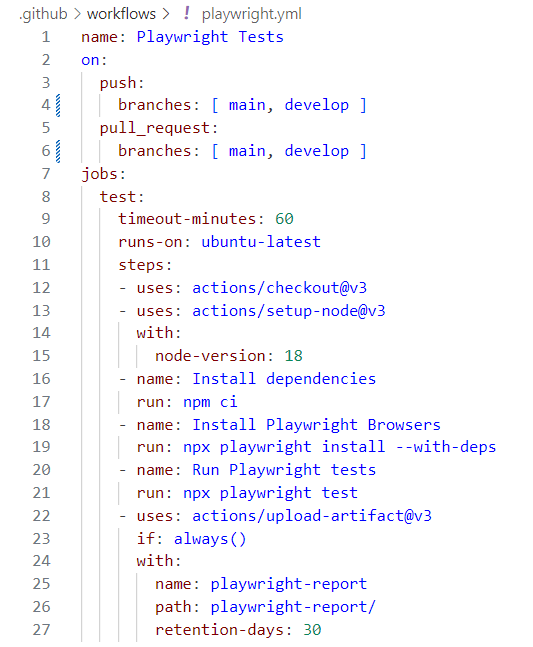

## 2.3 - INTEGRATION CONTINUE (CI)

### COMPETENCE(S) CONCERNEE(S) DANS LE REFERENTIEL

C3. Automatiser les phases de tests unitaires et d’analyses statiques du code source lors du partage des sources à l’aide d’un outil d’intégration continue de manière à prévenir les erreurs potentielles
- Configurer l’intégration continue, avec Github Actions ou Gitlab CI/CD
- Paramétrer les phases d'exécution des tests dans l’environnement de test à chaque push (sur la branche concernée)

### OBJECTIF PRINCIPAL DE CETTE PHASE DU PROJET

### REFLEXION ET APPLICATION D'UNE STRATEGIE DANS MON PROJET

Le fichier de configuration qui gère l'automatisation de l'intégration continue se génère automatiquement avec Playwright à chaque push sur la branche main ou develop :

> Expliquer + ? (...)

