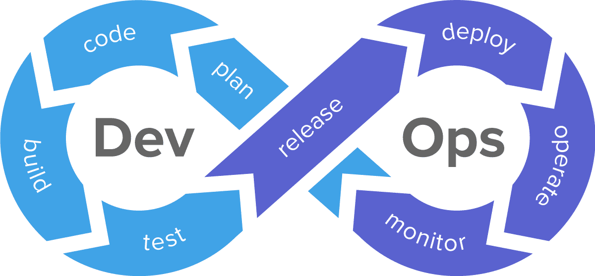

## 2.3 - INTEGRATION CONTINUE (CI)

### COMPETENCE(S) CONCERNEE(S) DANS LE REFERENTIEL

**C3. Automatiser les phases de tests unitaires et d’analyses statiques du code source lors du partage des sources à l’aide d’un outil d’intégration continue de manière à prévenir les erreurs potentielles**
- Configurer l’intégration continue, avec Github Actions ou Gitlab CI/CD
- Paramétrer les phases d'exécution des tests dans l’environnement de test à chaque push (sur la branche concernée)


### OBJECTIF PRINCIPAL DE CETTE PHASE DU PROJET

L'intégration continue ("Continuous Integration" ou "CI" en anglais) est une stratégie de développement logiciel qui permet d'automatiser des taches récurrentes comme les tests (détaillés précédement) et la dockerisation (que je vais expliciter dans cette partie). 

L'intégration continue permet également de :
- travailler en mode agile au (avec une mise en commun régulière du code produit)
- centraliser le travail de tous les dévelloppeurs dans un seul répertoire (par exemple, sur GitHub)
- détecter rapidement des erreurs dans son code dans celui des autres (et donc de gagner du temps et de l'argent dans la réalisation d'un projet)
___

Voici un schéma qui résume les différentes étapes de l'intégration continue (partie Dev uniquement):




### REFLEXION ET APPLICATION D'UNE STRATEGIE DANS MON PROJET

#### DOCKERISATION

##### AVANTAGES

L'avantage principal de la dockerisation est pouvoir créer des environnements isolés sur un seul et même système (ce qui évite aussi d'utiliser des machines virtuelles qui requièrent beaucoup de mémoire vive et de performance). Cela permet ensuite de déployer en ligne des versions complètes et indépendantes d'une partie cohérente d'une application (ex. : le frontend ou le backend).

Une image Docker est constituée d’une collection de fichiers qui regroupent tous les éléments essentiels (tels que les installations, le code d’application et les dépendances) nécessaires à la configuration d’un conteneur déployable entièrement opérationnel.

___

Voici les différentes étapes synthétiques de la dockerisation :


___

Pour la virtualisation et conteneurisation du backend de mon backend, j'ai choisi Docker car c'est la plateforme la plus populaire et la plus utilisée, en grande partie grâce à sa simplicité d'utilisation.


##### FICHIERS DE CONFIGURATION

Dans le cadre de mon projet, je n'ai eu besoin de ne dockeriser que le backend de l'application car, pour le frontend, Vercel est un outil plus adapté et plus simple d'utilisation pour la mise en production de sites accessibles publiquement.

Puisque la mise en production du backend et du front ne sont pas sur le même outil, il faut donc ajouter une variable d'environnement dans le frontend qui contient le lien en ligne du backend du projet et également configurer Vercel.

Voici les différentes étapes suivies, à commencer par l'ajout des fichiers de configuration suivants :

- **Dockerfile** (à la racine du projet) qui permet de lister les différentes commandes à lancer lors du build de l'image dans l'ordre chronologique (de haut en bas).

___
Capture d'écran du contenu du fichier Dockerfile (avec l'explication des différentes étapes) :


___

Voici une liste des instructions Dockerfile les plus communément utilisées :

FROM : Définit l'image de base qui sera utilisée par les instructions suivantes.

LABEL : Ajoute des métadonnées à l'image avec un système de clés-valeurs, permet par exemple d'indiquer à l'utilisateur l'auteur du Dockerfile.

ARG : Variables temporaires qu'on peut utiliser dans un Dockerfile.

ENV : Variables d'environnements utilisables dans votre Dockerfile et conteneur.

RUN : Exécute des commandes Linux ou Windows lors de la création de l'image. Chaque instruction RUN va créer une couche en cache qui sera réutilisée dans le cas de modification ultérieure du Dockerfile.

COPY : Permet de copier des fichiers depuis notre machine locale vers le conteneur Docker.

ADD : Même chose que COPY mais prend en charge des liens ou des archives (si le format est reconnu, alors il sera décompressé à la volée).

ENTRYPOINT : comme son nom l'indique, c'est le point d'entrée de votre conteneur, en d'autres termes, c'est la commande qui sera toujours exécutée au démarrage du conteneur. Il prend la forme de tableau JSON (ex : CMD ["cmd1","cmd1"]) ou de texte.

CMD : Spécifie les arguments qui seront envoyés au ENTRYPOINT, (on peut aussi l'utiliser pour lancer des commandes par défaut lors du démarrage d'un conteneur). Si il est utilisé pour fournir des arguments par défaut pour l'instruction ENTRYPOINT, alors les instructions CMD et ENTRYPOINT doivent être spécifiées au format de tableau JSON.

WORKDIR : Définit le répertoire de travail qui sera utilisé pour le lancement des commandes CMD et/ou ENTRYPOINT et ça sera aussi le dossier courant lors du démarrage du conteneur.

EXPOSE : Expose un port.

VOLUMES : Crée un point de montage qui permettra de persister les données.

USER : Désigne quel est l'utilisateur qui lancera les prochaines instructions RUN, CMD ou ENTRYPOINT (par défaut c'est l'utilisateur root).

___

- **.dockerignore** (à la racine du projet) qui permet d'ignorer certains dossiers ou fichiers lors de la construction d'une image (pour éviter de la surcharger au maximum et ainsi gagner du temps lors de l'étape du build).

___
Capture d'écran du contenu du fichier .dockerignore :


___

Voilà pourquoi il y préférable d'ignorer ces dossiers et ces fichiers lors de la construction de l'image docker : 
- Les dossiers "node_modules", "dist" et "db" car ils sont générés automatiquement avec la commande d'installation des dépendances (de plus, le contenu de la base de donnée en SQLite n'a pas vocation d'être sauvegardé durablement tant que l'application n'est pas utilisé par de vrais clients ; pour le moment, la base de données est réinitialisée à chaque execution du programme)
- Le fichier "request.http" car il n'est utile uniquement pour que le develloppeur puisse tester les différentes routes d'API avant de les utiliser ailleurs dans le code
- Les fichiers ".gitignore" et ".dockerignore" car ils ne sont utiles qu'au moment du build de l'image et pas après


##### Push sur Docker Desktop

Docker est un logiciel libre qui vous permet de simplifier la création des environnements d'exécution.

Pour pouvoir relier l'IDE avec DockerHub, il faut d'abord l'ouvrir depuis l'application de bureau.

Puis, dans le code, voici une liste de commandes qu'il est nécessaire de connaitre :

Afficher la version de Docker Desktop :
```bash
docker version
```

Se connecter avec Docker Desktop :
```bash
docker login
```

Créer une image dans Docker Desktop :
```bash
docker build -t image_backend_les_as_de_l_ux .
```

L'execution de l'image se passe dans le logiciel via une interface graphique :


Images sur Docker Desktop


Conteneurs sur Docker Desktop (execution des images sur un port spécifique en local)


##### Push sur DockerHub

DockerHub permet de stocker les images de nos projets (c'est comme GitHub)


Build de l'image tagguée dans DockerHub :
```bash
docker build -t jeremyfelix777/image_backend_les_as_de_l_ux:tag_v1 .
```

Pousser l'image tagguée dans DockerHub :
```bash
docker push jeremyfelix777/image_backend_les_as_de_l_ux:tag_v1
```

Les images sont maintenant hébergées sur DockerHub !

___

Liste des répertoires sur DockerHub :


Si on ne spécifie aucun tag, le tag par défaut sur DesktopHub est "latest".

___

Liste des tags (images versionnées) sur DockerHub :


##### Mise en prod automatique avec Render

Render sert à mettre en production automatiquement les images qui sont stockées sur DockerHub (cela fonctionne de la même façon que Vercel qui met en ligne du code source déposé sur GitHub).

Voici les différentes étapes de mise en production sur Render :
___

Etape 1 : "Ajouter un nouveau projet à mettre en production"


Choisir l'option "Web Service" (car ils restent opérationnels à tout moment).
___

Etape 2 : "Nature de la plateforme d'hébergement"


___

Etape 3 : "URL de l'image hébergée"


Copier-coller le lien du tag correspondant depuis DockerHub.
___

Etape 4 : "Configuration du conteneur"


Choisir un nom pour le projet ainsi que le serveur situé à Frankfurk (car c'est le plus proche parmi ceux disponibles) puis cliquer sur le bouton de déploiement.
___

Etape 5 : "Lancement du déploiement"


Un lien est généré pour accèder au projet dockerisé mis en ligne :

https://v2-backend-les-as-de-l-ux.onrender.com

Ce lien doit ensuite être ajouté dans le .env du frontend pour permettre l'échange de données avec le backend.


#### FICHIER DE GESTION DE L'INTEGRATION CONTINUE

Le fichier de configuration qui gère l'automatisation de l'intégration continue se génère automatiquement avec Playwright à chaque push sur la branche main ou develop :


Le contenu de ce fichier est interprété par GitHub qui s'occupe d'interpreter le contenu de ce fichier playwright.yml une fois que l'on pousse le répertoire local sur le répertoire distant.

Ce qu'il y a dans le "on" indique dans quelles circonstances la CI se déclenche : 
- Lors du push de la branche "main" ou la branche "develop"
- Lors du pull request impliquant la branche "main" ou la branche "develop"

Ce qu'il y a dans "jobs" indique quelles instructions doivent se déclencher et dans quel ordre le faire.
