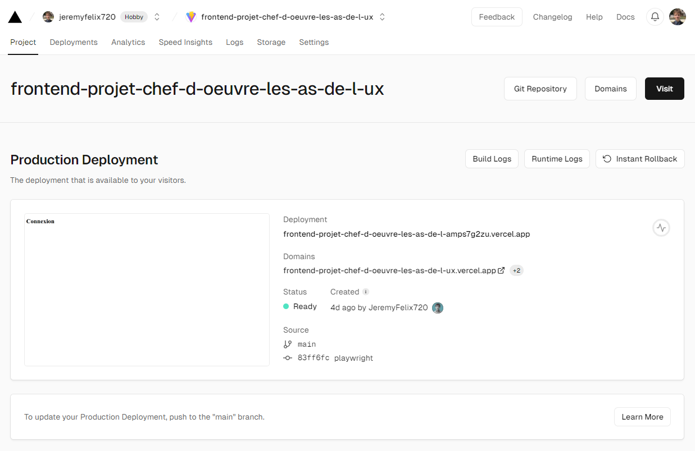

## 2.4 - DEPLOIEMENT CONTINU (CD)

### COMPETENCE(S) CONCERNEE(S) DANS LE REFERENTIEL

**C4. Concevoir un processus de livraison continue à l’aide d’outils d’automatisation de manière à l’intégrer au processus de développement**
- À chaque push (sur la branche concernée) paramétrer les phases de build pour un environnement de pré-production
- Paramétrer les phases de livraison des builds en environnement de pré-production

### OBJECTIF PRINCIPAL DE CETTE PHASE DU PROJET

Le déploiement continu ("Continuous Deployment" ou "CD" en anglais) est une stratégie de développement logiciel qui permet de publier automatiquement les modifications apportées dans le code source en mettant à jour la version de l'application disponible aux utilisateurs.

Les principaux avantages du CD sont les suivants :
- Il accélère la mise sur le marché en éliminant le décalage, généralement de plusieurs jours, semaines, voire mois, entre le codage et la valeur client
- Il valide si les changements apportés à une base de code (préalablement testée) sont corrects et stables en vue d'un déploiement autonome immédiat dans un environnement de production
- Etc.

Il est recommandé de viser une couverture des tests supérieure à 80%, mais c'est bel et bien la qualité des tests qui feront la différence pour réaliser un déploiement continu réussi.
___

Voici un schéma qui résume les différentes étapes du déploiement continue (partie "Ops" uniquement):

Comme le montre le schéma suivant, le déploiement continu va plus loin que l'intégration continue :

### REFLEXION ET APPLICATION D'UNE STRATEGIE DANS MON PROJET

#### MISE EN PRODUCTION DE L'APPLICATION

Pour permettre la livraison du frontend de l'application, j'ai utilisé la plateforme Vercel pour le mettre en production et ainsi rendre accessible publiquement la version stable de l'application (qui se trouve sur la branche main).

La plateforme Vercel récupère automatiquement le contenu du répertoire distant depuis GitHub à chaque "push" en local sur la branche main du frontend.

___

Tableau de bord de Vercel qui montre le déploiement du frontend :

