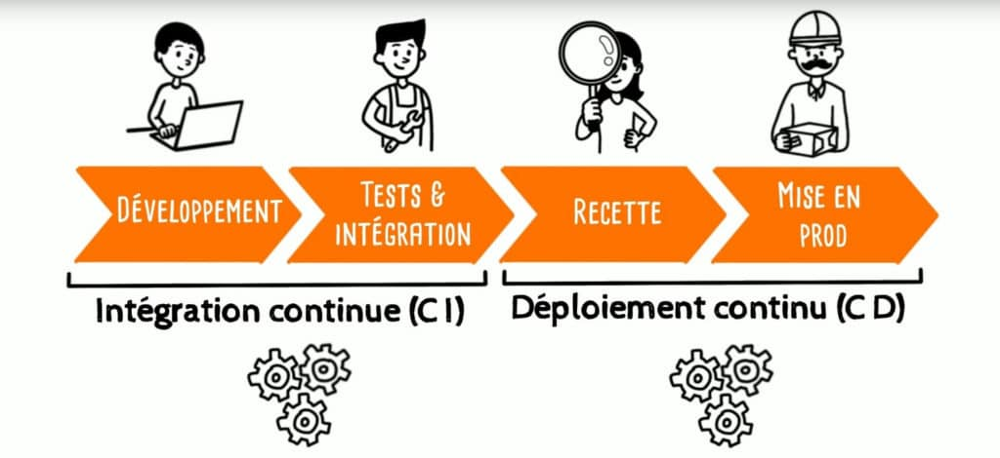

## 2.4 - DEPLOIEMENT CONTINUE (CD)

### COMPETENCE(S) CONCERNEE(S) DANS LE REFERENTIEL

C4. Concevoir un processus de livraison continue à l’aide d’outils d’automatisation de manière à l’intégrer au processus de développement
- À chaque push (sur la branche concernée) paramétrer les phases de build pour un environnement de pré-production
- Paramétrer les phases de livraison des builds en environnement de pré-production

### OBJECTIF PRINCIPAL DE CETTE PHASE DU PROJET

Le déploiement continue permet (...)

Voici un schéma qui résume les différentes étapes du déploiement continue (partie "Ops" uniquement):

Comme le montre le schéma suivant, le déploiement continue va plus loin que l'intégration continue :

### REFLEXION ET APPLICATION D'UNE STRATEGIE DANS MON PROJET

