# DEVOPS - PROJET CHEF-D'OEUVRE

## Jérémy FELIX

## Concepteur / Développeur d'Application Devops 2023 / 2024

____

## SOMMAIRE

1. Introduction
2. Validation des compétences du référentiel
  - Utilisation de Git et GitHub (C1)
  - Contrôle qualité (C2)
  - Intégration continue (C3)
  - Déploiement continue (C4)
  - Veille technologique (C6)
  - Travail en équipe en mode DevOps (C7)
3. Conclusion
4. Bibliographie

## 1 - INTRODUCTION

### REMERCIEMENTS

Tout d'abord, je tiens à remercier toute l'équipe pédagogique pour l'aide qu'ils m'ont apportée entre autre dans la réalisation de la partie DevOps de mon projet de fin d'étude que je vais aborder plus bas.

### CONTEXTE DU PROJET

Dans le cadre de la formation "Concepteur / Développeur d'Application DevOps" au sein de l'organisme SIMPLON, nous avions un projet chef-d'oeuvre à réaliser de A à Z sous la forme d'une application web.

Nous avons démarré ce projet relativement tôt dans le cours de l'année, ce qui nous a permi de mettre en pratique progressivement les compétences théoriques acquises.

### OBJECTIF DE CE DOSSIER

Mon objectif est de vous montrer que j'ai compris tout l'intérêt d'utiliser la méthodologie DevOps dans ce projet au travers d'explications détaillées sur le rôle de chaque outil du DevOps que j'ai mis en place concrètement (ou que je prévois d'utiliser plus tard).

### COMPOSITION DE L'EQUIPE

L’apprenant Jérémy FELIX a réalisé l’ensemble de ce projet chef-d’œuvre en totale autonomie.

### RESUME DU PROJET

L’application “Les As de l’UX” permet principalement de mettre en relation des chargés de création / refontes de site web (ou d’applications) avec les autres utilisateurs de l’application (amateurs et professionnels de l’UX design) afin de recueillir plusieurs avis extérieurs et constructifs (suivant le concept de l’intelligence collective) pour guider la mise en place de changements (destinés à être regroupés dans un PDF) pour améliorer l'UX Design les produits numériques existants sur le marché.

Mon modèle économique est simple : le client verse un somme d'argent sur un compte "Les As de l'UX" pour mettre en ligne son projet puis, une fois que le nomre maximum de commentaires a été atteint, le client selectionne les 5 meilleurs commentaires selon lui ; ce qui permet 1) aux commentateurs concernés de recevoir une partie de la somme itialement versée, 2) à "Les As de l'UX" de se dégager une marge avec l'argent restant et 3) que le client puisse télécharger le PDF de l'analyse UX globale sur son projet.

### LISTE DES COMPETENCES DU REFERENTIEL

#### C1. Assurer le versionnement d’un code source d’une application organisée en fonctionnalités et lots à l’aide d’un logiciel de contrôle de version de manière à garantir la fiabilité du code source dans un environnement multi-contributeurs
- Les sources sont versionnées avec Git
- Git en ligne de commande
- Respect d’un gitflow
- Utilisation de Github ou Gitlab par exemple

#### C2. Contrôler l'exécution du code source à l’aide de tests et d’outils d’analyses statiques du code source afin de minimiser le risque d’erreur dans un contexte de livraison continue
- Utilisation d’un linter (natif IDE ou externe)
- Environnement de test (virtuel ou conteneurisé par exemple)
- Au moins des tests unitaires d’intégrés (pas de minimum de coverage)
- Au moins des tests fonctionnels d’intégrés (pas de minimum de coverage)
- Savoir récupérer la valeur de la couverture du code par les tests
- Exécuter les tests
- Interpréter les résultats et les erreurs

#### C3. Automatiser les phases de tests unitaires et d’analyses statiques du code source lors du partage des sources à l’aide d’un outil d’intégration continue* de manière à prévenir les erreurs potentielles
- Configurer l’intégration continue, avec Github Actions ou Gitlab CI/CD
- Paramétrer les phases d'exécution des tests dans l’environnement de test à chaque push (sur la branche concernée)

#### C4. Concevoir un processus de livraison continue à l’aide d’outils d’automatisation de manière à l’intégrer au processus de développement
- À chaque push (sur la branche concernée) paramétrer les phases de build pour un environnement de pré-production
- Paramétrer les phases de livraison des builds en environnement de pré-production

#### C5. Développer l’architecture d’une application en micro-services à l’aide d’outils et de bibliothèques logicielles adaptées afin de réduire la complexité globale du système
- Décomposer une application monolithique en plusieurs composants et services
- Utiliser un service de conteneurisation pour tous les environnements : dev, test, prod, etc
- Adapter toute la chaîne DevOps à cette nouveauté

#### C6. Concevoir un système de veille technologique permettant la collecte, la classification, l’analyse et la diffusion de l’information aux différents acteurs de l’organisation afin d’améliorer la prise de décisions techniques
- Définir des objectifs à sa veille ou encore des thématiques de veille
- Planifier les temps de veille : durée, fréquence
- Organiser sa collecte d’information : outils de curation, outils de sauvegarde, etc
- Organiser le partage voir la diffusion des informations pertinantes

#### C7. Accompagner les collaborateurs au sein de l’équipe projet dans la sensibilisation et l’acculturation des méthodes d’organisation et de production DevOps de manière à optimiser le cycle de livraison d’un projet
- Expliquer et partager la culture DevOps
- Expliquer et partager la méthode DevOps : les rôles, les outils, les leviers, etc
- Analyser un processus Devops
- Préconiser des améliorations à un processus DevOps

### STRUCTURATION DES PARTIES DE VALIDATION DU REFERENTIEL

Pour chacune des parties, je préciserai :
- Les compétence(s) concernée(s) dans le référentiel
- L’objectif principal de cette phase du projet
- La réflexion et l'application d'une stratégie dans mon projet


## 2.1 - UTILISATION DE GIT ET GITHUB

### COMPETENCE(S) CONCERNEE(S) DANS LE REFERENTIEL

**C1. Assurer le versionnement d’un code source d’une application organisée en fonctionnalités et lots à l’aide d’un logiciel de contrôle de version de manière à garantir la fiabilité du code source dans un environnement multi-contributeurs**
- Les sources sont versionnées avec Git
- Git en ligne de commande
- Respect d’un gitflow
- Utilisation de Github ou Gitlab par exemple


### OBJECTIF PRINCIPAL DE CETTE PHASE DU PROJET

L'utilisation d'un outil de versionning (tel que git) et d'une plateforme de dépot de code source en ligne (tel que GitHub) permet à chaque développeur de disposer d’une copie complète du projet et de l’historique du projet.

Contrairement aux systèmes de gestion de versions centralisés autrefois populaires, les systèmes VCS distribués n’ont pas besoin d’une connexion constante à un dépôt central (chacun peut travailler un local sur une version à jour du code source collectif).

Git est le système de gestion de versions distribué le plus populaire et il est couramment utilisé pour le développement de logiciels open source et commerciaux, avec des avantages significatifs pour les individus, les équipes et les entreprises.


#### UTILISATION DES BRANCHES

La stratégie de création de branches permet à plusieurs développeurs de travailler sur différentes fonctionnalités et améliorations de la base de code, sans interférer avec le travail des autres développeurs.

Voici les principaux avantages :

- Plusieurs développeurs peuvent travailler sur la même base de code en parallèle, chacun sur leur branche de travail respective, en évitant les conflits et les problèmes de fusion

- Les développeurs peuvent apporter des modifications plus rapidement et plus efficacement sans se soucier d’interrompre le travail des autres développeurs

- Les modifications de la base de code sont correctement testées et vérifiées avant d’être fusionnées dans la branche principale. Cela permet de maintenir la qualité du code et réduit le risque de bugs et d’erreurs

- Possibilité de suivre les différentes versions du code source. Cela permet de dépanner et de revenir aux versions précédentes facilement

- Modifications effectuées sans affecter la base de code principale. Cela réduit considérablement le risque d’introduction de bugs et d’erreurs dans la production

- Expérimentation de nouvelles fonctionnalités et idées sans casser le code source et ne intégration des branches dans la branche principale que si elles fonctionnent parfaitement

- Meilleure communication entre les développeurs pour discuter des modifications plus facilement lors des Code Review (c'est-à-dire, l'examen systématique du code source d'un logiciel par des tiers dont le but est de trouver des bugs ou des vulnérabilités)


### REFLEXION ET APPLICATION D'UNE STRATEGIE DANS MON PROJET


#### GESTION DE PROJET

Pour me permettre de diviser le travail en plusieurs petits bouts de fonctionnalité cohérents, j'ai utilisé l'outil de gestion de projet Trello avec la méthodologie Agile KANBAN en réalisant plusieurs colonnes dans lesquelles j'ai rajouté au fur et à mesure des "tickets" datés comme on peut le voir sur la capture d'écran suivante :

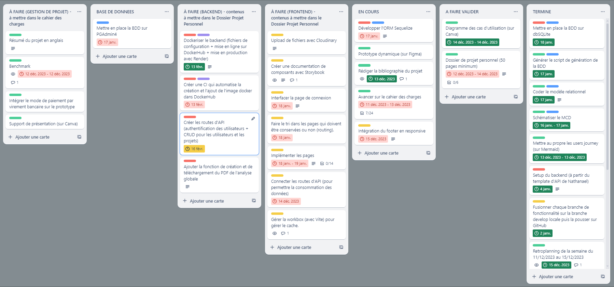

Les branches de fonctionnalité que j'ai créées dans mon code découlent naturellement des tickets référencés sur Trello.


#### ENVIRONNEMENT DE DEVELOPPEMENT

J'ai choisi d'utiliser l'IDE "Visual Studio Code" pour une question de facilité d'utilisation.


#### GITFLOW

Un workflow Git est une recette ou une recommandation expliquant comment utiliser Git pour accomplir une tâche de façon cohérente et productive. Les workflows Git encouragent les développeurs et les équipes DevOps à exploiter Git de façon efficace et cohérente.

Pour m'aider à respecter une méthodologie de gitflow, j'ai installé l'extenssion "Git Graph" sur mon IDE afin de pouvoir visualiser les différentes branches et sous-branches ainsi que les commits qui leur sont associés.

___

Capture d'écran de l'interface de Git Graph du frontend de mon projet :

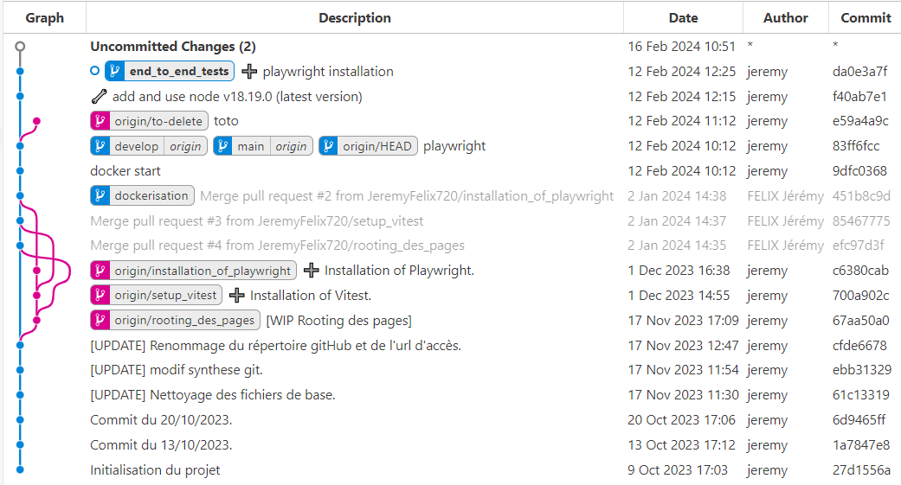

___

Capture d'écran de l'interface de Git Graph du backend de mon projet :


___

Etant seul dans le cadre de ce projet, j'ai décidé d'autovalider les pull requests sur GitHub mais cela ne m'a pas empeché de travailler de façon structurée (comme si j'étais en groupe) en créant des branches de fonctionnalité sur une branche develop (une sous-branche de main) pour y integrer les évolutions constantes du code source (avec potentielement des erreurs qui viennent s'y greffer) et pas directement dans la branche main qui doit être réservée à la mise en production (avec une version stable de l'application, sans anomalie, avec un ensemble cohérent de fonctionnalités et suffisant pour le déployer en ligne sans mauvaise surprise).

___

Voici la procédure que j’ai appliquée pour envoyer une branche de fonctionnalité sur GitHub afin d’effectuer la validation collective (uniquement lorsqu'une branche de travail est entièrement terminée) :

On peut travailler sur plusieurs branches en parralèle (il faut simplement faire toutes les étapes suivantes quand une des branches est terminée).

Rejoindre la branche "develop" :
```bash
git checkout develop
```

Récupérer les dernieres modifications sur la branche develop depuis la branche develop du dépôt distant :
```bash
git pull origin develop 
```

Rejoindre sa branche de travail :
```bash
git checkout fonctionnality_branch_name
```

Fusionner ma branche de fonctionnalité avec la branche "develop" en local :
```bash
git rebase develop  # contrairement à git merge, git rebase ne supprime pas les commits.
```

Exporter ma branche de fonctionnalité dans le répertoire distant :
```bash
git push --set-upstream origin fonctionnality_branch_name
```

**Faire valider sa Pull Request (sur gitHub) par ses collègues (ou par un formateur)**

Sur GitHub :
- Aller dans "Pull requests" > "New pull request"
- Choisir la branche "develop" à gauche et la branche de fonctionnalité à droite
- Créer la pull request
- Retourner dans "Pull requests" (normalement, cela ouvre la Pull Request automatiquement)
- Vérifier le code au préalable
- Cliquer sur "Merge pull request" puis "Confirm merge"

Si la pull request de ma fonctionnalité a été validée à l'unanimité sur GitHub, mettre à jour la branche develop locale qui a été fusionnée sur GitHub :
```bash
git checkout develop
git pull origin develop
```

Supprimer la branche de fonctionnalité locale :
```bash
git branch -d fonctionnality_branch_name
```

Passer au ticket suivant en recréant une nouvelle branche de fonctionnalité à partir de la branche develop.


#### ORGANISATION DES DOSSIERS

Pour simplifier l'organisation de mon travail, j'ai décomposé mon projet en plusieurs "microservices" (aux contenus cohérents mais plus réduits), c'est-à-dire des répertoires en local (frontend, backend et documentation), qui sont tous reliés à des répertoires distants aux contenus équivalents.

___
Capture d'écran du répertoire pour le frontend hébergé sur gitHub :

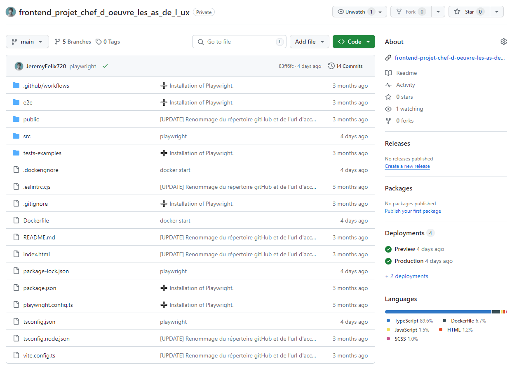
___

Capture d'écran des branches sur GitHub de la partie frontend :


___

De plus, j'ai créé un 3ème répertoire sur GitHub pour sauvegarder tous les documents en lien avec la gestion de mon projet chef-d'oeuvre.


#### VERSIONNEMENT DU CODE SOURCE

Pour pouvoir revenir facilement en arrière lorsqu’un bug survient, j'ai pris l'habitude de faire des commits (sauvegarde du code en local) afin de conserver un historique des modifications effectuées dans le code, comme en témoigne la capture d'écran suivante (après avoir tapé la commande ```git log``` dans le terminal) :

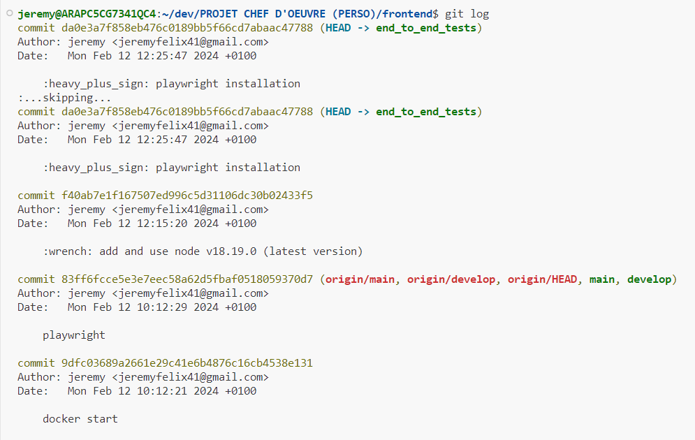

___

Pour me rappeler de faire des commits régulièrement (à chaque ajout de code fonctionnel et cohérent), j’ai lancé un timmer en arrière-plan qui émet un « bip » tous les 15 minutes.

Cela m'a également permit de nommer plus efficacement mes commits. A noter que le site gitmoji.dev m’a permit d’illustrer le nommage de mes commit de façon visuelle.


#### COMMANDE GIT QUE J'AI UTILISEES

Voici une liste (non exaustive) des commandes git que j'ai utilisées dans le cadre de mon projet :

Cloner un répertoire :
```bash
git clone https://github.com/nom_depositaire/repository_name my_project_name 
```

Créer une branche de travail sur le dépot local (pour developper une fonctionnalité correspondant à un ticket) :
```bash
git branch fonctionnality_branch_name
```

Créer une branche de travail sur le dépot distant (à partir d'une branche locale existante) :
```bash
git push --set-upstream origin develop
```

Se déplacer sur une branche :
```bash
git checkout fonctionnality_branch_name
```

Créer une branche et se déplacer dessus :
```bash
git checkout -b fonctionnality_branch_name
```

Voir le nom de la branche sur laquelle on se trouve actuellement :
```bash
git branch
```

Renommer une branche :
```bash
git branch -m new_branch_name
```

Voir l'historique des commits de sa branche de travail :
```bash
git log
```

Ajouter tous les fichiers (ou seulement certains) dans la zone d'index pour le prochain commit :
```bash
git add .
```

Faire une sauvegarde local de son code source :
```bash
git commit -m "message de commit"
```

Envoyer le code source depuis le dépot local vers le dépot distant :
```bash
git push
```

Réinitialiser les derniers changements (ne marche pas si on a fait un push avant) :
```bash
git stash
```

Réinitialiser les derniers changements depuis son dernier commit :
```bash
git stash apply
```

Revenir au commit précedent :
```bash
git reset --soft HEAD^
```
ou
```bash
git reset --soft branch_name
```

Etc.

## 2.2 - CONTROLE QUALITE

### COMPETENCE(S) CONCERNEE(S) DANS LE REFERENTIEL

**C2. Contrôler l'exécution du code source à l’aide de tests et d’outils d’analyses statiques du code source afin de minimiser le risque d’erreur dans un contexte de livraison continue**
- Utilisation d’un linter (natif IDE ou externe)
- Environnement de test (virtuel ou conteneurisé par exemple)
- Au moins des tests unitaires d’intégrés (pas de minimum de coverage)
- Au moins des tests fonctionnels d’intégrés (pas de minimum de coverage)
- Savoir récupérer la valeur de la couverture du code par les tests
- Exécuter les tests
- Interpréter les résultats et les erreurs

### OBJECTIF PRINCIPAL DE CETTE PHASE DU PROJET

L'élaboration de tests est essentiel pour s'assurer que le code produit correspond à des exigences de qualités (bonnes pratiques universelles ou définie au sein d'une équipe).

Or, dans le déroulement du projet chef d'oeuvre, je n'avais pas encore réaliser l'implémentation de mon prototype dans le code. Cette partie du dossier traitera donc de tous les tests que je prévois d'effectuer à l'avenir.

### REFLEXION ET APPLICATION D'UNE STRATEGIE DANS MON PROJET

#### CHOIX ET UTILISATION D'UN LINTER

##### UTILITE D'UN LINTER

Un linter permet d'analyse les erreurs statiques (c'est-à-dire, sans exécuter le code). Par exemples, il vérifie statiquement :
- les variables qui n'existent pas
- les variables inutilisées
- les doubles déclarations de variables, de fonctions, etc.
- la mauvaise organisation du code
- le non respect des bonnes pratiques d'écriture de code
- les erreurs de syntaxe

Une fois analysé par le linter et corrigé (automatiquement ou manuellement), le code résultant est plus lisible et plus cohérent, ce qui le rend plus facile à maintenir et à déboguer.

##### VEILLE TECHNOLOGIQUE SUR LES LINTERS

Dans le cadre de mon projet, j'ai comparé les linters suivants :
1. ESLint
2. JSLint

1. Voici les avantages de ESLint :
- c'est le linter JavaScript le plus répandu
- il est compatible avec la majorité des éditeurs de textes
- l'affichage des erreurs et les warnings se font directement dans le code
- il est très simple à installer
- il est entièrement personnalisable
- il peut corriger automatiquement les erreurs

2. Voici les avantages de JSLint :
- c'est un outil Open Source
- il est strict et applique un ensemble spécifique de règles pour l’écriture de code JavaScript (il exige par exemples l'utilisation des points-virgules, des accolades autour des déclarations conditionnelles et des boucles, etc.)
- il est compatible avec plusieurs éditeurs de textes

Pour l'analyse statique de mon code, j'ai opté pour le linter ESLint pour sa simplicité d'utilisation et sa compatibilité avec JavaScript et avec mon IDE Visual Studio Code. De plus, l'autre linter comparé (JSLint) est moins flexible que les autres outils d'analyse statique en raison de ses options de personnalisation limitées et il ne convient pas aux projets complexes qui nécessitent plus de flexibilité et beaucoup de personnalisation.


##### INSTALLATION ET UTILISATION DU LINTER 

Je n'ai malheureseument pas eu le temps d'installer et de configurer un linter dans mon projet mais j'ai néanmoins prévu de le faire plus tard (en utilisant ESLint).


#### CHOIX ET UTILISATION D'UN OUTIL DE TESTING

Les tests "End To End" (ou "e2e"), c'est-à-dire "de bout en bout", permettent de vérifier que :
- la partie frontend d'une application se comporte comme prévu du début à la fin. Le testeur doit se mettre dans la peau d’un utilisateur et dérouler les tests comme s’il utilisait véritablement l’outil mis à sa disposition
- le frontend est correctement intégré avec le backend ou d'autres webservices.

Les principaux avantages de tests e2e sont :
- D'augmenter la portée des tests 
- D'assurer le bon fonctionnement de l’application 
- Réduire le temps nécessaire à la commercialisation de l’application 
- Réduire les coûts 
- Détecter les bogues
- Permettre une meilleure expérience client optimale

Les tests e2e sont obligatoires car ils sont les seuls tests permettant de vérifier le parfait fonctionnement de l’application du point de vue du métier (c'est-à-dire, que ses fonctionnalités sont cohérentes par rapport aux scénarios utilisateur).

Généralement, les tests e2e doivent être réalisés juste avant la mise en production de l'application.

##### VEILLE SUR LES FRAMEWORKS DE TEST END TO END

Voici une comparaison entre les frameworks de test e2e principaux sur le marché aujourd'hui :
1. Playwright
2. Cypress

1. Les avantages de Playwright sont les suivants :
- C'est un framework de test open-source
- Il supporte officiellement JavaScript/TypeScript, Python, Java et .Net
- Il est sensiblement plus rapide que les autres solutions de test end-to-end concurrentes
- Il offre des tests fiables et proche de la réalité de l'expérience utilisateur (grâce à l'auto-wait) ; par exemple, avant de cliquer sur un élément, il s'assure qu'il soit présent, visible et stable
- Il est livré avec des outils puissants tels que Trace Viewer (qui capture des informations telles que des instantanés DOM et des screencasts d'exécution de tests permettant d'enquêter sur la raison de l’échec du test), Codegen (qui permet de faciliter l'écriture des tests) et Playwright Inspector (qui permet d'inspecter l'exécution des tests)

2. Les avantages de Cypress sont les suivants :
- Utilise un vrai navigateur pour faire des tests (offre donc des résultats de l'expérience utilisateur plus réalistes, contrairement à un navigateur "headless" utilisé par les concurrents qui ne font que simuler des navigateurs)
- A accès à la couche réseau via l'application (pour contrôler toutes les requêtes réseau entrant et sortant de l'application)
- Prend en compte la visibilité des éléments lors de l'exécution des tests (il sera par exemple impossible de cliquer sur un bouton invisible)
- Ses commandes sont très intuitives et lisibles

J'ai opté pour le framework de test Playwright car c'est celui que l'on a le plus pratiqué lors de la formation et qu'il donnent lieu à des tests plus robustes, plus faciles à écrire et à maintenir que ses conccurents.


##### INSTALLATION ET UTILISATION DE PLAYWRIGHT

Une fois la configuration initale terminée (mise à jour d'Ubuntu, installation des dépendances, de NodeJS, etc.), l'installation de Playwright s'effectue en une seule commande (à l'intérieur de mon dossier frontend de mon projet) :

```bash
npm init playwright@latest
```
Répondre aux questions comme suit :
- Mettre les tests e2e dans un dossier nommé "e2e"
- Ajouter un workflow avec github actions
- Installer le navigateur de Playwright, etc. 


Voici les étapes à suivre pour utiliser Playwright :

Lancer les tests avec un navigateur "headless" (voir la note en dessous) :
```bash
npm run e2e
```
ou
```bash
npx playwright test
```

___

**Note :** un navigateur "headless" ("sans tête" en anglais) signifie qu'il peut fonctionner sans interface utilisateur graphique. Le programme de notre application peut lire et interagir avec le navigateur headless, tout comme un utilisateur interagirait avec un navigateur traditionnel.

___

Ensuite, je souhaitais pourvoir vérifier visuellement que les tests sur les éléments d'interface passaient correctement, c'est pourquoi (après avoir un suivi un TP en executant XLaunch et Node JS), j'ai lancé la commande pour lancer les tests en mode UI (avec une interface graphique qui simule le navigateur ouvert) :

```bash
npx playwright test --ui
```

Après environ 2 minutes d'attente, voici le message d'erreur qui s'affiche :


Afin de résoudre ce problème, j'ai partagé mon répertoire gitHub à une collègue puis j'ai clonné le frontend de mon projet sur son PC (un autre Windows 10) puis, après avoir lancé XLaunch et taper les commandes suivantes :

```bash
npm install
npx playwright test --ui
```

Une interface "Playwright Test" s'est ouverte :

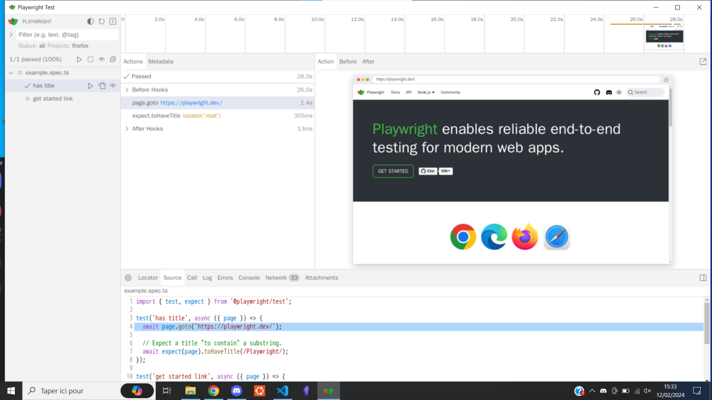

Il n'y a que 2 tests : "has title" et "get started link", qui vérifient respectivement s'il y a un titre dans la page et si l'utilisateur redirigé vers la page d'accueil de l'application.


##### LISTES DES SCENARIOS

Il n'est pas pertinent de tester tous les cas de figure possibles auquel l'utilisateur pourrait être confronté. Pour être pertinent, un test e2e doivent être calqués sur les scénarios qui modèlisent les attentes du métier (simplifiés pour n’exécuter que les étapes critiques passantes ou non passantes). Chaque scenario est donc un ensemble de cas de tests.

Voici quelques scénarios utilisateur identitifiés et priorisés par ordre d'importance par rapport à la logique métier :

**Scénario 1 : "Un utilisateur crée un nouveau compte"**
- Rémy se rend sur l'application "Les As de l'UX" (vérifier que la page de connexion est affichée par defaut lors de l'ouverture de l'application)
- se crée un nouveau compte (vérifier que, lorsqu'il clique sur le bouton "pas de compte ? créez-en un !", il soit bien redirigé vers la page "Création / Modification de votre compte")
- rempli son pseudonyme (vérifier que le champs n'accepte que le type "string")
- rempli sa date de naissance (vérifier que le champs n'accepte que le type "date")
- rempli son adresse e-mail (vérifier que le champs n'accepte que le type "e-mail")
- rempli sa ville (vérifier que le champs n'accepte que le type "string")
- rempli son code postal (vérifier que le champs n'accepte que le type "number")
- rempli son numéro de téléphone (vérifier que le champs n'accepte que le type "string")
- rempli son mot de passe (vérifier que le champs n'accepte que le type "string" ET vérifier que les carractères sont bien remplacés par des "*" lorsque l'on clique sur le bouton "masquer" et réciproquement aussi)
- confirme son mot de passe
- consulte les Conditions Générales d'Utilisation (vérifier que le lien "CGU" le redirige bien vers la page "CGU")
- revient en arrière (vérifier que, lorqu'il clique sur le bouton "retour", il soit bien redirigé vers la page "Création / Modification de votre compte" sans avoir perdu les informations renseignées précédement)
- accepte les Conditions Générales d'Utilisation (vérifier que la coche est cochée lorsqu'il clique dessus et réproquement aussi)
- valide le formulaire (vérifier que lorsque le bouton d'envoi du formulaire est cliqué, cela enregistre bien toutes les informations textuelles et l'image de l'avatar renseignées)

___

**Scénario 2 : "Un utilisateur se connecte à son compte"**
- Rémy se rend sur l'application "Les As de l'UX" (vérifier que la page de connexion est affichée par defaut lors de l'ouverture de l'application)
- rempli son mot de passe (vérifier que le champs n'accepte que le type "string" ET vérifier que les carractères sont bien remplacés par des "*" lorsque l'on clique sur le bouton "masquer" et réciproquement aussi)
- rempli son adresse e-mail (vérifier que le champs n'accepte que le type "e-mail")
- se connecte à l'application (vérifier que, si l'email et le mot de passe existent dans la base de données, il soit redirigé vers la page "Home" de l'application ET vérifier qu'aucun élément du footer ne soit sélectionné)  
___

**Scénario 3 : "Un client publie un projet"**
- Intégration du scénario "Un utilisateur se connecte à son compte"
- Rémy se rend dans la rubrique "Projets" (vérifier qu'il est bien redirigé vers la page "projets" ET que l'option "projet" du footer est bien surligné)
- rempli/modifie un nouveau projet (vérifier que le bouton "+" le redirige bien vers la page "Création/Modification d'un projet")
- rempli le titre (vérifier que le champs n'accepte que le type "string")
- rempli/modifie l'URL du projet (vérifier que le champs n'accepte que le type "string")
- ajoute/remplace la photo pour illustrer la bannière (vérifier que l'aperçu s'affiche bien)
- rempli/modifie la description du projet (vérifier que le champs n'accepte que le type "string")
- ajoute un nouveau scenario à analyser (vérifier que le champs n'accepte que le type "string" ET que, lorsque l'on clique sur le bouton "valider le scénario", le texte renseigné dans le champs se rajoute bien à la suite dans la To Do List en dessous)
- ajoute un deuxième et un troisième scénario
- supprime le deuxième scénario (vérifier que, lorsque l'on clique sur le bouton "poubelle" dans un élément de la liste, le scénario ciblé est bien supprimé)
- ajoute une nouvelle page à analyser (vérifier que le champs n'accepte que le type "string" ET que, lorsque l'on clique sur le bouton "valider la page", le texte renseigné dans le champs se rajoute bien à la suite dans la To Do List en dessous)
- ajoute une deuxième et une troisième page
- supprime la deuxième page (vérifier que, lorsque l'on clique sur le bouton "poubelle" dans un élément de la liste, la page ciblée est bien supprimée)
- selectionne le budget (vérifier que la valeur du menu déroulant change bien en fonction de l'option selectionnée ET que l'indication du nombre de participants soit cohérente par rapport à la valeur précédente renseignée)
- met le projet en favoris
- valide le formulaire (vérifier que lorsque le bouton d'envoi du formulaire est cliqué, cela enregistre bien toutes les informations textuelles et l'image de la bannière renseignées)
___

**Scénario 4 : "Un utilisateur publie un commentaire"**
- Intégration du scénario "Un utilisateur se connecte à son compte"
- Rémy se rend dans la rubrique "projets" (vérifier que lorsqu'il clique sur l'option "projets" du footer, il soit bien redirigé vers la page "projets" et que l'option devienne surlignée)
- met un projet en favoris (vérifier qu'en cliquant sur le bouton "favoris", la carte se place bien dans la sous-rubrique "projets favoris")
- se renseigne sur un projet en particulier (vérifier qu'en cliquant sur le bouton "voir plus", il soit bien redirigé vers la page "projet" correspondante)
- se rend dans l'analyse UX (vérifier qu'en cliquant sur le bouton "voir l'analyse UX", il soit bien redirigé vers la page "analyse" correspondante à ce projet)
- se renseigne sur les problèmes d'accessibilité (vérifier qu'en cliquant sur le bouton "problèmes d'accessibilité", il soit bien redirigé vers la page "problèmes d'accessibilité" correspondante à ce projet)
- consulte les lois de l'UX correspondantes (vérifier que le carroussel soit fonctionnel et ne contient que les fiches mémos liées à cette catégorie "accessibilité" et que, parmi ces fiches, elles soient à l'état "débloquées" par l'utilisateur de l'application)
- consulte le projet en ligne (vérifier qu'en cliquant sur le bouton "accèder au projet en ligne", il soit bien redirigé sur le projet en ligne correspondant)
- signale un problème d'accessibilité rencontré (vérifier que le champs n'accepte que le type "text")
- indique un scenario concerné par l'anomalie détectée (vérifier que l'option selectionnée a bien l'attribut "checked")
- indique 3 pages concernées par l'anomalie détectée (vérifier que les options selectionnées ont bien l'attribut "checked")
- publie son commentaire (vérifier que, lorsqu'il clique sur le bouton "publier ma remarque", le commentaire soit bien rajouté dans la sous-rubrique "mes commentaires publiés" en dessous et que le champs de description du problème et des 2 checklists soient réinitialisés)
- lit la notification à l'écran qui lui indique qu'il a publié un commentaire avec succès et remporté 5 points (vérifier que les 5 points se sont bien rajoutés à son score initial)
___

**Scénario 5 : "Un client effectue le classement des meilleurs commentaires et télécharge le PDF de l'analyse UX"**
- Intégration du scénario "Un utilisateur se connecte à son compte"
- Rémy se rend dans la rubrique "projets" (vérifier que lorsqu'il clique sur l'option "projets" du footer, il soit bien redirigé vers la page "projets" et que l'option devienne surlignée)
- selectionne son projet en particulier (vérifier qu'en cliquant sur le bouton "voir plus", il soit bien redirigé vers la page "projet" correspondante)
- se renseigne sur l'analyse UX de son projet (vérifier qu'en cliquant sur le bouton "voir l'analyse UX", il soit bien redirigé vers la page "analyse" correspondante à ce projet)
- essaye de télécharger le PDF comprenant tous les commentaires publiés mais n'y parvient pas (vérifier que le bouton "télécharger le PDF de l'analyse" est de couleur grisée et ne déclenche aucune action lorsqu'il clique dessus)
- commence le classement des commentaires (vérifier que l'utilisateur soit dépositaire de ce projet ET que, lorsqu'il clique sur le bouton "classer les commentaires", il soit bien redirigé vers la page "classification des commentaires")
- selectionne ses 5 commentaires préférés ; par exemple, il choisi le projet 42 en 3ème position (vérifier que l'option "N°2" est retirée de tous les autres commentaires)
- lit la notification à l'écran qui lui indique qu'il a terminé son classement et qu'il peut télécharger le PDF de l'analyse UX (vérifier que les 5 positions ont été attribuées parmi l'ensemble des commentaires)
- revient sur la page "analyse ux" (vérifier qu'en cliquant sur le bouton "voir l'analyse UX", il soit bien redirigé vers la page "analyse" correspondante à ce projet)
- télécharge le PDF comprenant tous les commentaires (vérifier que le bouton "télécharger le PDF de l'analyse" n'est plus grisé et que le PDF comprenant le contenu de la page "classification des commentaires" a bien été téléchargé grâce à l'outil correspondant)
___

**Scénario 6 : "Un utilisateur récupère ses gains"**
- Intégration du scénario "Un utilisateur se connecte à son compte"
- Rémy se rend dans la rubrique "projets" (vérifier que lorsqu'il clique sur l'option "projets" du footer, il soit bien redirigé vers la page "projets" et que l'option devienne surlignée)
- se rend sur la page "réception des gains" (vérifier que le bouton "récupérer mes gains" le redirige bien vers la page "réception des gains")
- renseigne son numéro de RIB (vérifier que le champs n'accepte que le type "text" ET que le RIB soit au bon format)
- valide le formulaire (vérifier que le champs n'accepte que le type "text" ET que le RIB soit au bon format)
- lit la notification à l'écran qui lui indique qu'un e-mail de confirmation du virement lui a été envoyé (vérifier que le mail a bien été expédié à l'adresse e-mail de l'utilisateur)

___

Pour chacun des champs de formulaire mentionnés ci-dessus : vérifier que le champs est surligné lorsqu'il clique dessus et qu'il revient à son état initial lorsqu'il clique en dehors du champs.

Les tests e2e doivent être automatisés car ils sont effectués de façon récurente à chaque push.


##### TESTS UNITAIRES

Les tests unitaires permettent de s’assurer que chaque unité (fonctions, méthodes ou classes) fonctionne comme prévu, indépendamment d’autres parties de l’application. Les tests unitaires doivent être automatisés, reproductibles et rapides à exécuter.

Par manque de temps, et parce que mon backend n'est pas très abouti au moment de la rédaction de ce rapport, j'ai décidé de reporter la mise en place des tests unitaires à plus tard.

J'ai néanmoins appri en les utiliser dans le cadre de TP (notament le "tp-full-tests") en utilisant l'outil de testing Vitest en employant la méthode du "Test Driven Development" (TDD) ou "Red, Green, Refactor" :


Voici une courte explication pour chacune de ces phases du TDD :
1. **Phase rouge :** Le develloppeur ajoute des tests pertinents pour vérifier que un exemple de résultat à obtenir en fonction de certains paramètres en entrée de l'unité testée mais ces tests doivent échouer car cette dernière est soit vide, soit inexistante
2. **Phase verte :** Le develloppeur implémente l'unité testée et veille à ce qu'elle réponde aux exigences des tests unitaires définis précédement afin que ceux-ci soient progressivement validés
3. **Refactoring :** Le develloppeur restructure le code de l'unitée testée pour en améliorer la qualité et la maintenabilité tout en veillant à ce que tous les tests unitaires soient toujours validés

___

Voici les étapes à suivre pour installer "Vitest" :

1. Ajouter le script dans le package.json :
```ts
"scripts": {
    ...,
    "test": "vitest"
}
```

2. Lancer les commandes suivantes :
```bash
npm i
npm run test
npm i -D vitest
```

3. Dans le dossier src, créer un sous-dossier "__tests__" dans le lequels on va mettre tous nos fichiers de tests (un fichier par unité à tester de préférence) dont l'extention se termine par ".test.ts"

4. Dans le dossier src, les fichiers contenant les fonctions se trouvent dans un sous-dossier "modules"

___

Pour limiter au maximun la dette technique (c'est-à-dire, la méconnaissance de son code), il est nécessaire de connaitre la valeur (en pourcentage) de la couverture du code par les tests unitaires.


## 2.3 - INTEGRATION CONTINUE (CI)

### COMPETENCE(S) CONCERNEE(S) DANS LE REFERENTIEL

**C3. Automatiser les phases de tests unitaires et d’analyses statiques du code source lors du partage des sources à l’aide d’un outil d’intégration continue de manière à prévenir les erreurs potentielles**
- Configurer l’intégration continue, avec Github Actions ou Gitlab CI/CD
- Paramétrer les phases d'exécution des tests dans l’environnement de test à chaque push (sur la branche concernée)


### OBJECTIF PRINCIPAL DE CETTE PHASE DU PROJET

L'intégration continue ("Continuous Integration" ou "CI" en anglais) est une stratégie de développement logiciel qui permet d'automatiser des taches récurrentes comme les tests (détaillés précédement) et la dockerisation (que je vais expliciter dans cette partie). 

L'intégration continue permet également de :
- travailler en mode agile au (avec une mise en commun régulière du code produit)
- centraliser le travail de tous les dévelloppeurs dans un seul répertoire (par exemple, sur GitHub)
- détecter rapidement des erreurs dans son code dans celui des autres (et donc de gagner du temps et de l'argent dans la réalisation d'un projet)
___

Voici un schéma qui résume les différentes étapes de l'intégration continue (partie Dev uniquement):


### REFLEXION ET APPLICATION D'UNE STRATEGIE DANS MON PROJET

#### DOCKERISATION

##### AVANTAGES

L'avantage principal de la dockerisation est pouvoir créer des environnements isolés sur un seul et même système (ce qui évite aussi d'utiliser des machines virtuelles qui requièrent beaucoup de mémoire vive et de performance). Cela permet ensuite de déployer en ligne des versions complètes et indépendantes d'une partie cohérente d'une application (ex. : le frontend ou le backend).

Une image Docker est constituée d’une collection de fichiers qui regroupent tous les éléments essentiels (tels que les installations, le code d’application et les dépendances) nécessaires à la configuration d’un conteneur déployable entièrement opérationnel.

___

Voici les différentes étapes synthétiques de la dockerisation :


___

Pour la virtualisation et conteneurisation du backend de mon backend, j'ai choisi Docker car c'est la plateforme la plus populaire et la plus utilisée, en grande partie grâce à sa simplicité d'utilisation.


##### FICHIERS DE CONFIGURATION

Dans le cadre de mon projet, je n'ai eu besoin de ne dockeriser que le backend de l'application car, pour le frontend, Vercel est un outil plus adapté et plus simple d'utilisation pour la mise en production de sites accessibles publiquement.

Puisque la mise en production du backend et du front ne sont pas sur le même outil, il faut donc ajouter une variable d'environnement dans le frontend qui contient le lien en ligne du backend du projet et également configurer Vercel.

Voici les différentes étapes suivies, à commencer par l'ajout des fichiers de configuration suivants :

- **Dockerfile** (à la racine du projet) qui permet de lister les différentes commandes à lancer lors du build de l'image dans l'ordre chronologique (de haut en bas).

___
Capture d'écran du contenu du fichier Dockerfile (avec l'explication des différentes étapes) :


___

Voici une liste des instructions Dockerfile les plus communément utilisées :

FROM : Définit l'image de base qui sera utilisée par les instructions suivantes.

LABEL : Ajoute des métadonnées à l'image avec un système de clés-valeurs, permet par exemple d'indiquer à l'utilisateur l'auteur du Dockerfile.

ARG : Variables temporaires qu'on peut utiliser dans un Dockerfile.

ENV : Variables d'environnements utilisables dans votre Dockerfile et conteneur.

RUN : Exécute des commandes Linux ou Windows lors de la création de l'image. Chaque instruction RUN va créer une couche en cache qui sera réutilisée dans le cas de modification ultérieure du Dockerfile.

COPY : Permet de copier des fichiers depuis notre machine locale vers le conteneur Docker.

ADD : Même chose que COPY mais prend en charge des liens ou des archives (si le format est reconnu, alors il sera décompressé à la volée).

ENTRYPOINT : comme son nom l'indique, c'est le point d'entrée de votre conteneur, en d'autres termes, c'est la commande qui sera toujours exécutée au démarrage du conteneur. Il prend la forme de tableau JSON (ex : CMD ["cmd1","cmd1"]) ou de texte.

CMD : Spécifie les arguments qui seront envoyés au ENTRYPOINT, (on peut aussi l'utiliser pour lancer des commandes par défaut lors du démarrage d'un conteneur). Si il est utilisé pour fournir des arguments par défaut pour l'instruction ENTRYPOINT, alors les instructions CMD et ENTRYPOINT doivent être spécifiées au format de tableau JSON.

WORKDIR : Définit le répertoire de travail qui sera utilisé pour le lancement des commandes CMD et/ou ENTRYPOINT et ça sera aussi le dossier courant lors du démarrage du conteneur.

EXPOSE : Expose un port.

VOLUMES : Crée un point de montage qui permettra de persister les données.

USER : Désigne quel est l'utilisateur qui lancera les prochaines instructions RUN, CMD ou ENTRYPOINT (par défaut c'est l'utilisateur root).

___

- **.dockerignore** (à la racine du projet) qui permet d'ignorer certains dossiers ou fichiers lors de la construction d'une image (pour éviter de la surcharger au maximum et ainsi gagner du temps lors de l'étape du build).

___
Capture d'écran du contenu du fichier .dockerignore :

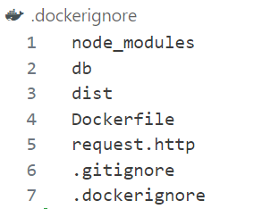
___

Voilà pourquoi il y préférable d'ignorer ces dossiers et ces fichiers lors de la construction de l'image docker : 
- Les dossiers "node_modules", "dist" et "db" car ils sont générés automatiquement avec la commande d'installation des dépendances (de plus, le contenu de la base de donnée en SQLite n'a pas vocation d'être sauvegardé durablement tant que l'application n'est pas utilisé par de vrais clients ; pour le moment, la base de données est réinitialisée à chaque execution du programme)
- Le fichier "request.http" car il n'est utile uniquement pour que le develloppeur puisse tester les différentes routes d'API avant de les utiliser ailleurs dans le code
- Les fichiers ".gitignore" et ".dockerignore" car ils ne sont utiles qu'au moment du build de l'image et pas après


##### Push sur Docker Desktop

Docker est un logiciel libre qui vous permet de simplifier la création des environnements d'exécution.

Pour pouvoir relier l'IDE avec DockerHub, il faut d'abord l'ouvrir depuis l'application de bureau.

Puis, dans le code, voici une liste de commandes qu'il est nécessaire de connaitre :

Afficher la version de Docker Desktop :
```bash
docker version
```

Se connecter avec Docker Desktop :
```bash
docker login
```

Créer une image dans Docker Desktop :
```bash
docker build -t image_backend_les_as_de_l_ux .
```

L'execution de l'image se passe dans le logiciel via une interface graphique :

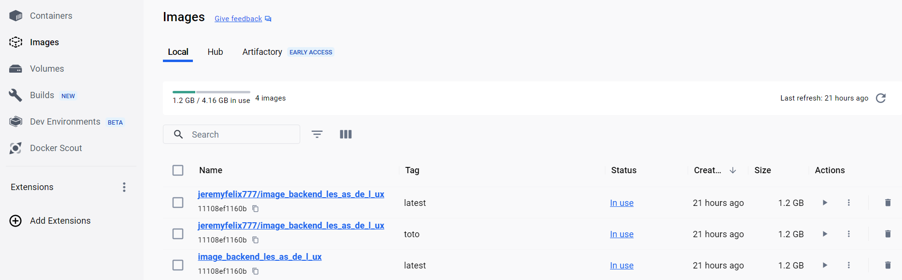
Images sur Docker Desktop


Conteneurs sur Docker Desktop (execution des images sur un port spécifique en local)


##### Push sur DockerHub

DockerHub permet de stocker les images de nos projets (c'est comme GitHub)


Build de l'image tagguée dans DockerHub :
```bash
docker build -t jeremyfelix777/image_backend_les_as_de_l_ux:tag_v1 .
```

Pousser l'image tagguée dans DockerHub :
```bash
docker push jeremyfelix777/image_backend_les_as_de_l_ux:tag_v1
```

Les images sont maintenant hébergées sur DockerHub !

___

Liste des répertoires sur DockerHub :

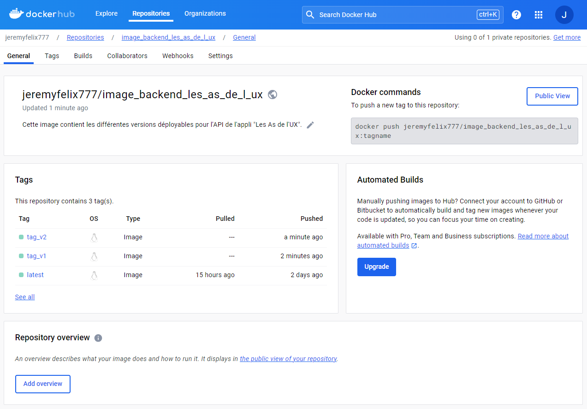

Si on ne spécifie aucun tag, le tag par défaut sur DesktopHub est "latest".

___

Liste des tags (images versionnées) sur DockerHub :

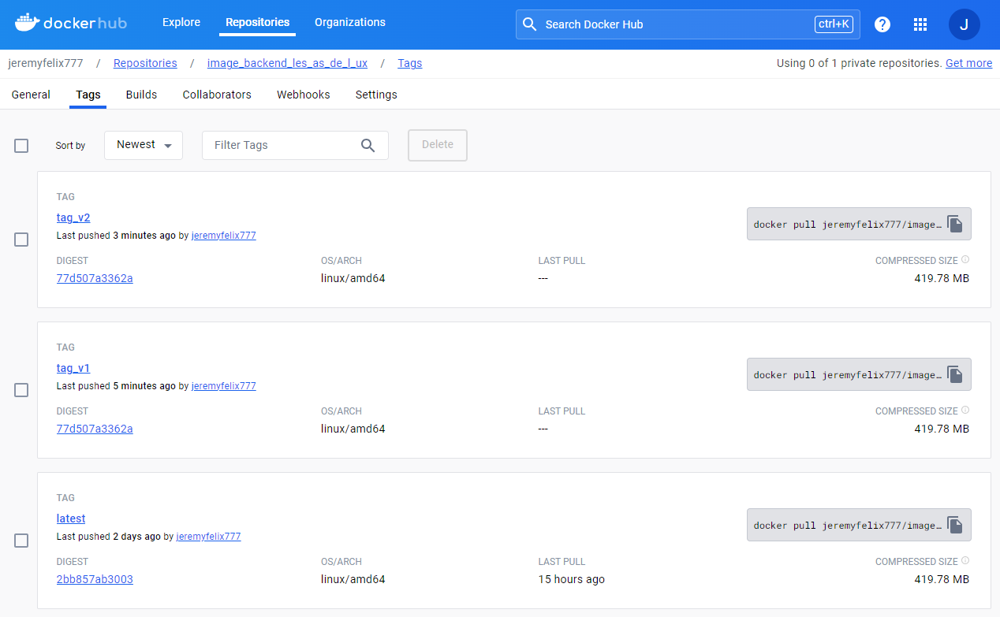


##### Mise en prod automatique avec Render

Render sert à mettre en production automatiquement les images qui sont stockées sur DockerHub (cela fonctionne de la même façon que Vercel qui met en ligne du code source déposé sur GitHub).

Voici les différentes étapes de mise en production sur Render :
___

Etape 1 : "Ajouter un nouveau projet à mettre en production"

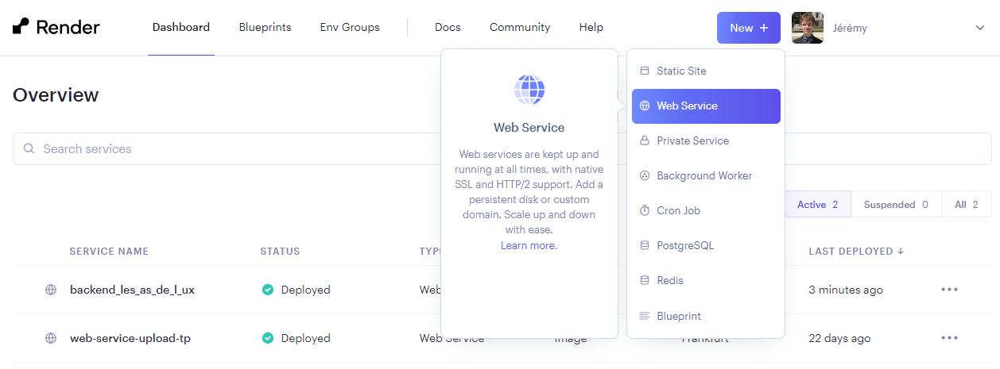

Choisir l'option "Web Service" (car ils restent opérationnels à tout moment).
___

Etape 2 : "Nature de la plateforme d'hébergement"

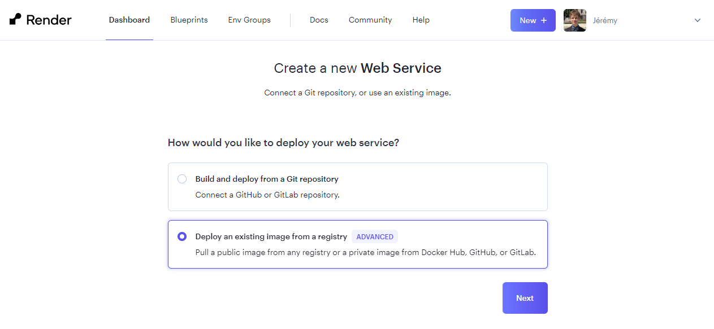

___

Etape 3 : "URL de l'image hébergée"


Copier-coller le lien du tag correspondant depuis DockerHub.
___

Etape 4 : "Configuration du conteneur"

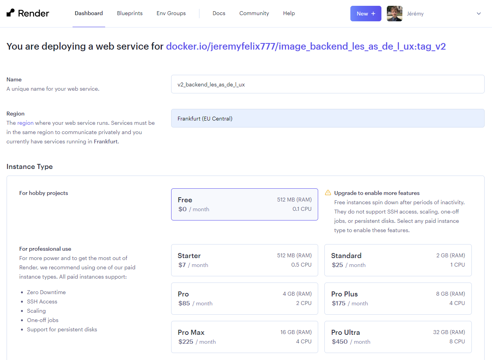

Choisir un nom pour le projet ainsi que le serveur situé à Frankfurk (car c'est le plus proche parmi ceux disponibles) puis cliquer sur le bouton de déploiement.
___

Etape 5 : "Lancement du déploiement"


Un lien est généré pour accèder au projet dockerisé mis en ligne :

https://v2-backend-les-as-de-l-ux.onrender.com

Ce lien doit ensuite être ajouté dans le .env du frontend pour permettre l'échange de données avec le backend.


#### FICHIER DE GESTION DE L'INTEGRATION CONTINUE

Le fichier de configuration qui gère l'automatisation de l'intégration continue se génère automatiquement avec Playwright à chaque push sur la branche main ou develop :


Le contenu de ce fichier est interprété par GitHub qui s'occupe d'interpreter le contenu de ce fichier playwright.yml une fois que l'on pousse le répertoire local sur le répertoire distant.

Ce qu'il y a dans le "on" indique dans quelles circonstances la CI se déclenche : 
- Lors du push de la branche "main" ou la branche "develop"
- Lors du pull request impliquant la branche "main" ou la branche "develop"

Ce qu'il y a dans "jobs" indique quelles instructions doivent se déclencher et dans quel ordre le faire.

## 2.4 - DEPLOIEMENT CONTINU (CD)

### COMPETENCE(S) CONCERNEE(S) DANS LE REFERENTIEL

**C4. Concevoir un processus de livraison continue à l’aide d’outils d’automatisation de manière à l’intégrer au processus de développement**
- À chaque push (sur la branche concernée) paramétrer les phases de build pour un environnement de pré-production
- Paramétrer les phases de livraison des builds en environnement de pré-production

### OBJECTIF PRINCIPAL DE CETTE PHASE DU PROJET

Le déploiement continu ("Continuous Deployment" ou "CD" en anglais) est une stratégie de développement logiciel qui permet de publier automatiquement les modifications apportées dans le code source en mettant à jour la version de l'application disponible aux utilisateurs.

Les principaux avantages du CD sont les suivants :
- Il accélère la mise sur le marché en éliminant le décalage, généralement de plusieurs jours, semaines, voire mois, entre le codage et la valeur client
- Il valide si les changements apportés à une base de code (préalablement testée) sont corrects et stables en vue d'un déploiement autonome immédiat dans un environnement de production
- Etc.

Il est recommandé de viser une couverture des tests supérieure à 80%, mais c'est bel et bien la qualité des tests qui feront la différence pour réaliser un déploiement continu réussi.
___

Voici un schéma qui résume les différentes étapes du déploiement continue (partie "Ops" uniquement):


___

Comme le montre le schéma suivant, le déploiement continu va plus loin que l'intégration continue :

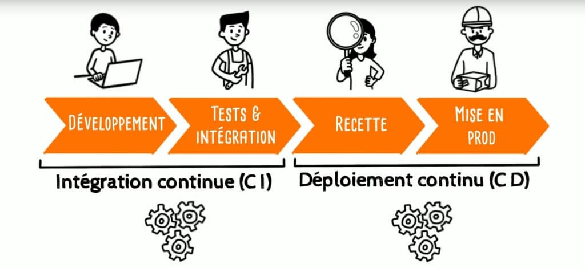


### REFLEXION ET APPLICATION D'UNE STRATEGIE DANS MON PROJET

#### MISE EN PRODUCTION DE L'APPLICATION

Pour permettre la livraison du frontend de l'application, j'ai utilisé la plateforme Vercel pour le mettre en production et ainsi rendre accessible publiquement la version stable de l'application (qui se trouve sur la branche main).

La plateforme Vercel récupère automatiquement le contenu du répertoire distant depuis GitHub à chaque "push" en local sur la branche main du frontend.

___

Tableau de bord de Vercel qui montre le déploiement du frontend :

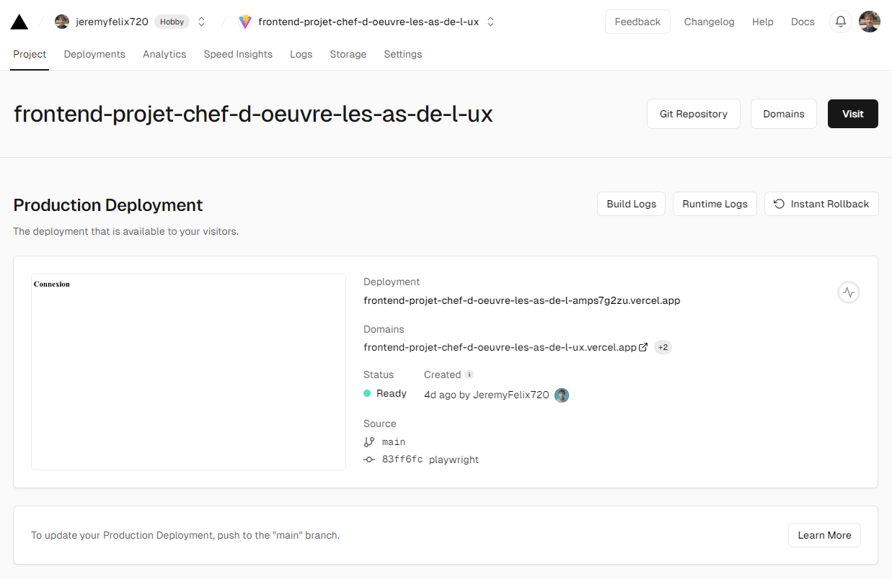

## 2.5 - VEILLE TECHNOLOGIQUE

### COMPETENCE(S) CONCERNEE(S) DANS LE REFERENTIEL

**C6. Concevoir un système de veille technologique permettant la collecte, la classification, l’analyse et la diffusion de l’information aux différents acteurs de l’organisation afin d’améliorer la prise de décisions techniques**
- Définir des objectifs à sa veille ou encore des thématiques de veille
- Planifier les temps de veille : durée, fréquence
- Organiser sa collecte d’information : outils de curation, outils de sauvegarde, etc
- Organiser le partage voir la diffusion des informations pertinantes


### OBJECTIF PRINCIPAL DE CETTE PHASE DU PROJET

#### INTERETS DE LA VEILLE

Les principaux avantages (aussi bien pour un individu que pour une équipe) d'effectuer régulièrement de la veille est :
- D'anticiper les menaces et trouver des solutions en amont (cela permet d'avoir de meilleures chances et davantage de flexibilité pour contrer ces dangers ou encore de se prémunir de leurs impacts)
- D'être à l’écoute de son marché en permanence (cela permet de  rester en permanence au goût du jour pour être informé des dernières innovations)
- D'adapter sa stratégie des concurrents et saisir des opportunités (cela permet de conserver son avantage concurrentiel par rapport aux autres entreprises)


### REFLEXION ET APPLICATION D'UNE STRATEGIE DANS MON PROJET

#### HABITUDES DE VEILLE

Tout au long du déroulement de mon projet chef-d'oeuvre, j'ai pris l'habitude de faire de la veille technologique pour :
- comparer plusieurs outils qui rendent le même service (afin de pouvoir justifier le choix d'un outil en particulier sur la base de benchmarks thèmatiques)
- me renseigner sur les meilleures pratiques en matière de gestion de projet et de développement (afin d'être à jour pour exercer plus tard le métier de Concepteur / Dévelloppeur DevOps et correspondre aux exigences de qualités actuelles toujours plus nombreuses)

#### PARTAGE DE MA VEILLE TECHNOLOGIQUE

Pour partager sa veille, il est possible d'utiliser un cloud (tel que Google Drive ou GitHub), un salon dédié dans un réseau social (tel que LinkedIn, Slack ou Discord), etc.

Voici quelques exemples de types de veille technologique que j'ai été amené à réaliser dans le cadre de ma formation à Simplon.

##### LEXIQUE DES TERMES TECHNIQUES

Dès le début de l'année de formation, j'ai commencé à rédiger un lexique personnel de tous les termes techniques en lien avec le métier avec le métier de Concepteur / Dévelloppeur DevOps.

Le fait de mettre ces définitions par écrit (classées par ordre alphabétique) m'ont aidé à mieux les retenir et de pouvoir m'y référer régulièrement en cas de besoin. 

Les points d'améliorations possibles pour les définitions de mon lexique serait :
- De les classer par thème
- D'en synthétiser certaines
- De les enrichir avec des liens qui permettrait d'approffondir ces notions

Lorsque mon lexique sera plus présentable et davantage documenté, je projete de le rendre accessible publiquement même si son utilité initiale était surtout de m'aider à mieux mémoriser le vocabulaire technique (parfois très jargoneux) du monde de l'informatique.


#### SALON DE MISE EN COMMUN DE LA VEILLE TECHNOLOGIQUE

Sur le réseau social Discord, notre promo a mis en place plusieurs salons de discussions et de partage pour séparer les différentes catégories d'informations (avant, toutes les informations pertinentes était souvent noyées dans le salon "Général") ; il y a notamment un salon "Ressources" qui permet à tous les apprenants et aux formateurs d'y partager les liens des articles et des vidéos découverts lors de leurs veilles technologiques respectives.

#### TEMPS DE VEILLES PLANIFIEES ET ENCADREES

Le programme de la formation comprend des crénaux dédiés pour laisser le temps aux apprenants d'effectuer des recherches sur les sujets indiqués comme par exemples :
- L'éco-responsabilité du numérique
- L'intelligence artificielle
- Le fonctionnement du web
- Les raccourcis sur l'IDE Visual Studio Code
- La méthologie Agile
- Flexbox
- Les frameworks CSS
- Les frameworks de test
- React
- Git
- Reddit
- Les microservices
- Etc.

Une restitution collective est organisée après le temps de recherche afin de mettre en commun oralement (tour à tour) de ce que chaque apprenant a compris d'après les informations trouvées sur le web à propos d'un même sujet (ce qui permet d'obtenir plusieurs points de vue complémentaires).

#### BONNES PRATIQUES DE VEILLE

Les formateurs nous également appris à appliquer les bonnes pratiques pour faire des veilles technologiques efficaces en veillant à :
- Contextualiser l'article (date de rédaction, profession de l'auteur, nature de la source d'information)
- Aller du moins précis au plus précis dans les explications
- Synthétiser les informations trouvées quand c'est possible
- Ajouter les sources de ses recherches dans une bibliographie
- Mettre en forme rapidement les textes et les images en utilisant le language Markdown (ce qui permet de se concentrer davantage sur le contenu en lui-même)

Pour faire des recherches ciblées et trouver des informations fiables sur des technologies, il est possible de consulter sa feuille de triche ; il suffit pour cela de taper "cheatsheet" suivi du nom de la technologie visée.

## 2.6 - TRAVAIL EN EQUIPE EN MODE DEVOPS

### COMPETENCE(S) CONCERNEE(S) DANS LE REFERENTIEL

**C7. Accompagner les collaborateurs au sein de l’équipe projet dans la sensibilisation et l’acculturation des méthodes d’organisation et de production DevOps de manière à optimiser le cycle de livraison d’un projet**
- Expliquer et partager la culture DevOps
- Expliquer et partager la méthode DevOps : les rôles, les outils, les leviers, etc
- Analyser un processus Devops
- Préconiser des améliorations à un processus DevOps


### OBJECTIF PRINCIPAL DE CETTE PHASE DU PROJET

Avant l'apparition de la culture DevOps, les entreprises dans l'informatique fonctionnaient en mode "Silots", c'est-à-dire que les équipes de develloppeurs et celles des DevOps étaient dans des bureaux séparés et avaient des objectifs antagonistes : 
- La première, l'équipe de développement, a pour objectif principal de faire évoluer l'application, en ajoutant de nouvelles fonctionnalités ou en corrigeant des bugs, le plus rapidement possible et cela, dans un délai et un coût moindres, souvent au détriment de la qualité quand les contraintes de planning arrivent
- La seconde équipe, l'équipe des opératifs, a comme objectif de maintenir l'application en conditions opérationnelles, en garantissant sa stabilité et sa qualité

___

Schéma de cycle en "V" qui réprésente l'ancien fonctionnement très rigide (sans chevauchement des taches possible) avant l'apparition de l'Agilité :


___

Vers le début du 21ème siècle, le manifeste Agile a été rédigé pour élaborer une nouvelle manière de travailler dans le developpement web, dont voici les 4 grands piliers :
- Les individus et les interactions plus que les processus et les outils
- Des logiciels opérationnels plus qu’une documentation exhaustive
- La collaboration avec les clients plus que la négociation contractuelle
- L’adaptation au changement plus que le suivi d’un plan

De ces piliers découlent 12 principes sous-jacents :
- Livrer de la valeur au client
- Intégrer les demandes de changement
- Livrer fréquemment une version opérationnelle
- Assurer une coopération entre le client et l’équipe
- Réaliser les projets avec des personnes motivées
- Privilégier le dialogue en face à face
- Mesurer l'avancement sur la base d'un produit opérationnel
- Faire avancer le projet à un rythme soutenable et constant
- Contrôler l’excellence technique et à la conception
- Minimiser la quantité de travail inutile
- Construire le projet avec des équipes auto-organisées
- Améliorer constamment l'efficacité de l'équipe

Avec la démocratisation d’Internet (Google a connu un succès fulgurant à partir de 2003) et la multiplication des données consommées, de nouveaux standards industriels sont apparues, notamment le SRE (Site Reliability Engineering) dont les principaux objectifs sont de créer des systèmes logiciels évolutifs et fiables.

Avec le DevOps, les développeurs et les Operatifs (« Ops ») se sont rapprochés pour colaborer ensemble.

Le nom DevOps découle de l’union de « development » et « operations ». DevOps est un ensemble de pratiques qui met l’accent sur la collaboration et la communication entre les développeurs de logiciels et les professionnels des opérations IT car le devOps n’est pas qu’une chaine d’outils automatisées, mais ce sont aussi des habitudes de communications entre les membres d’une équipe. En effet, tous les outils mis en place ne servent à rien s'il n'y a pas la volonté des développeurs et des opératifs de travailler ensemble.

Voici les 4 principes fondateurs du DevOps :
- L'automatisation du cycle de vie du développement logiciel (automatisation des tests, des constructions, des déploiements, de la provision des environnements de développement, et d'autres tâches manuelles qui peuvent ralentir ou introduire des erreurs humaines dans le processus de livraison du logiciel)
- Une collaboration et communication efficace
- L'amélioration continue et la minimisation des gaspillages (par exemple, avec la réduction des délais de mise en production)
- La priorité mise sur les besoins des utilisateurs avec des boucles de rétroaction courtes (pour se concentrer sur ce que veulent vraiment les utilisateurs réels et comment le leur fournir)

Voici quelques avantages apportés par le DevOps :
- Confiance des équipes entre elles
- Accélération des livraisons et des déploiements (par exemple, au moyen de l'automatisation)
- Résolution des tickets plus rapide
- Gestion plus efficace des tâches non planifiées

Les enjeux du DevOps d’aujourd’hui est d’assurer la qualité et le suivi du code et de l’application dans un environnement multi-contributeurs.

## 3 - CONCLUSION

Les principaux problèmes rencontrés pour le DevOps de mon projet chef-d'oeuvre étaient les suivants :
- Le fait que j'ai dû travailler seul ne m'a pas permi d'avoir beaucoup d'avis extérieurs et de prendre le recul nécessaire
- Comme je n'ai pas eu le temps d'implémenter autant que je l'aurai voulu le frontend et le backend de mon projet, je n'ai pas pu utiliser de façon optimale certains outils du devOps qui se base sur des applications déjà bien abouties (notamment les frameworks de test)
- Comprendre l'enchainement logique entre les différents outils du DevOps et comment ceux-ci étaient liés les uns avec les autres

La compétence C5 n'a pas pu être abordée dans ce dossier car les microservices n'étaient pas un choix technique privilégié dans l'architecture logicielle du projet mais ce point sera abordé lors de l'oral.

En conclusion, suite à la rédaction de ce dossier portant sur le DevOps de mon projet chef d'oeuvre "Les As de l'UX", j'ai été sensibilisé aux enjeux de mettre en place une stratégie Agile de ce genre que je vais pouvoir désormais appliquer dans un contexte professionnel en entreprise pour exercer le métier de Concepteur / Développeur d'Application DevOps.

## 4 - BIBLIOGRAPHIE

https://docs.github.com/fr/get-started/using-git/about-git

https://www.bocasay.com/fr/strategie-creation-branches-expliquee/

https://www.all4test.fr/blog-du-testeur/tests-end-to-end-e2e-guide-complet-2022/

https://blog.testingdigital.com/quest-test-de-bout-bout-end-to-end-1288

https://www.ionos.fr/digitalguide/sites-internet/developpement-web/quest-ce-que-le-test-driven-development/

https://geekflare.com/fr/playwright-vs-cypress/

https://ichi.pro/fr/avantages-et-inconvenients-de-cypress-outil-de-test-de-bout-en-bout-avant-de-le-choisir-comme-outil-d-automatisation-57704566939336

https://mindsers.blog/fr/post/linting-good-practices/

https://encause.fr/les-5-meilleurs-lingueurs-de-node-js/

https://devopssec.fr/article/creer-ses-propres-images-docker-dockerfile

https://www.generation5.org/quel-est-linteret-dune-bonne-veille-technologique%E2%80%89/

https://blog-gestion-de-projet.com/manifeste-agile-valeurs-et-principes/#t-1653060296441
